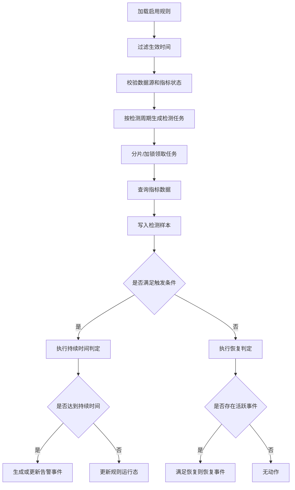
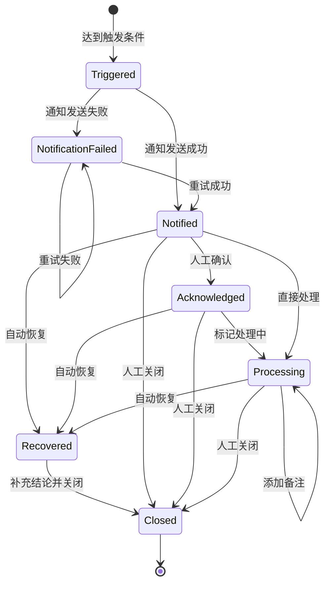

# 告警规则引擎与状态机详细设计

## 1. 设计目标与一期边界

告警规则引擎承接一期“简单阈值规则、告警事件闭环、邮件通知、Kafka/PostgreSQL 默认规则模板”的建设目标，支撑应用、服务器、中间件、数据库和业务指标的统一告警检测。

一期实现单指标阈值规则、周期性检测、持续时间判定、自动恢复、活跃告警去重、重复通知间隔、告警状态机、失败补偿和默认模板。不实现复杂组合规则、动态阈值、完整静默、无人确认升级、工单联动和自动修复，但模型保留字段。

## 2. 规则模型

| 实体 | 说明 |
| --- | --- |
| `alert_rule` | 规则主表，描述对象、指标、阈值、持续时间、通知策略 |
| `alert_rule_target` | 规则适用对象，可表达单对象、对象组、应用下实例、标签选择 |
| `alert_rule_runtime` | 运行态，记录最近检测时间、连续异常开始时间、失败原因 |
| `alert_event` | 告警事件，一个未恢复问题对应一个活跃事件 |
| `alert_event_snapshot` | 触发、恢复、失败时的证据快照 |
| `alert_process_record` | 确认、处理中、备注、关闭等处理记录 |
| `notification_record` | 通知渠道、接收人、状态、失败原因和重试次数 |

`alert_rule` 关键字段包括 `rule_name`、`object_type`、`object_subtype`、`scope_type`、`object_id`、`metric_code`、`query_expr`、`aggregation`、`operator`、`threshold`、`duration_seconds`、`evaluation_interval_seconds`、`recovery_threshold`、`recovery_duration_seconds`、`severity`、`effective_time_config`、`repeat_interval_seconds`、`notify_policy_id`、`enabled`、`business_line_id`、`app_id`。

启用规则时必须校验对象权限、数据源健康、指标近期数据、持续时间大于等于检测周期、通知对象可解析、邮件渠道可用、阈值与指标单位匹配。

## 3. 检测调度



| 项 | 建议 |
| --- | --- |
| 最小检测周期 | P0/P1 30 秒或 1 分钟；P2/P3 1-5 分钟 |
| 分片方式 | 按 `rule_id % shard_count` 或任务表抢占 |
| 查询窗口 | `duration_seconds + 1 个 evaluation_interval` |
| 乱序容忍 | 允许 1-2 个采集周期延迟 |
| 检测超时 | 记录检测失败，不生成业务告警 |
| 延迟目标 | 告警检测延迟不超过 1 分钟 |

## 4. 持续时间、恢复和去重

持续时间算法：

```text
if current_sample.satisfy_trigger_condition:
    if runtime.abnormal_started_at is null:
        runtime.abnormal_started_at = current_sample.timestamp
    if current_sample.timestamp - runtime.abnormal_started_at >= rule.duration_seconds:
        trigger_or_update_alert_event()
    else:
        only_record_sample()
else:
    runtime.abnormal_started_at = null
    try_recover_existing_event()
```

恢复条件默认使用触发条件反向表达，并允许 `recovery_threshold` 和 `recovery_duration_seconds` 做回滞控制。例如连接使用率 `> 90%` 触发，`< 85%` 持续 2 分钟恢复。

活跃告警唯一键：

```text
dedup_key = rule_id + object_id + metric_code + dimension_hash
```

同一 `dedup_key` 未恢复前只维护一个活跃事件。重复通知间隔建议 P0 5 分钟、P1 10 分钟、P2 30 分钟、P3 60 分钟；一期可统一默认 10 分钟并允许规则覆盖。

## 5. 状态机



| 状态 | 说明 |
| --- | --- |
| `triggered` | 已触发，等待通知 |
| `notified` | 至少一个渠道通知成功 |
| `notification_failed` | 通知失败，等待重试或人工处理 |
| `acknowledged` | 已确认 |
| `processing` | 处理中 |
| `recovered` | 指标已恢复 |
| `closed` | 处理闭环完成 |
| `silenced` | 二期静默预留 |
| `escalated` | 二期升级预留 |

人工关闭未恢复告警必须填写关闭原因，并写审计记录。

## 6. 失败补偿与幂等

| 场景 | 处理 |
| --- | --- |
| 数据源超时 | 记录检测失败，不生成业务告警 |
| 鉴权失败 | 规则进入配置异常，通知维护人或平台管理员 |
| 指标无数据 | 标记数据不足，连续超过阈值后配置异常 |
| 通知失败 | 按邮件重试策略重试，最终进入 `notification_failed` |
| 事件写入失败 | 检测任务重试，依赖 `dedup_key` 幂等 |
| 审计写入失败 | 高风险操作失败或进入待审计补偿队列 |

幂等键包括 `dedup_key + active_status`、`alert_id + notify_type + receiver + repeat_window`、`rule_id + object_id + dimension_hash + sample_time`。

## 7. Kafka 默认规则模板

| 模板 | 条件 | 级别 |
| --- | --- | --- |
| Broker 不可用 | 连续失败 3 次 | P1 |
| 消费积压 | `lag > 10000` 持续 10 分钟 | P2 |
| 核心消费积压 | `lag > 50000` 持续 10 分钟 | P1 |
| 有积压无消费 | `consume_rate = 0 且 lag > 0` 持续 5 分钟 | P1 |
| 死信新增 | `dead_letter_count > 0` 持续 5 分钟 | P2 |
| Broker 磁盘预警 | `disk_usage > 85%` 持续 5 分钟 | P2 |
| Broker 磁盘严重 | `disk_usage > 95%` 持续 3 分钟 | P1 |
| 副本不足 | `under_replicated_partitions > 0` 持续 5 分钟 | P1 |

通知对象按 Kafka 对象负责人、Topic/Consumer Group 关联应用负责人、业务线值班组、SRE 兜底组解析。

## 8. PostgreSQL 默认规则模板

| 模板 | 条件 | 级别 |
| --- | --- | --- |
| 实例不可用 | 连续连接失败 3 次 | P1 |
| 连接使用率预警 | `connection_usage > 80%` 持续 5 分钟 | P2 |
| 连接使用率严重 | `connection_usage > 90%` 持续 5 分钟 | P1 |
| 慢 SQL | `slow_sql_count > 默认阈值` 持续 5 分钟 | P2 |
| 锁等待 | `lock_wait_count > 0` 或等待超阈值持续 5 分钟 | P1 |
| 死锁 | `deadlock_count > 0` | P1 |
| 复制延迟 | `replication_lag_seconds > 60` 持续 5 分钟 | P1 |
| 磁盘预警 | `disk_usage > 85%` 持续 5 分钟 | P2 |
| 磁盘严重 | `disk_usage > 95%` 持续 3 分钟 | P1 |
| Cache 命中率低 | `cache_hit_rate < 95%` 持续 10 分钟 | P2 |

SQL 文本、库表名、会话明细和连接串默认敏感，明文查看必须走授权和审计。

## 9. 验收标准

规则可按周期执行，检测延迟不超过 1 分钟；未达到持续时间不创建告警；达到持续时间创建事件；同一规则对象维度只保留一个活跃事件；恢复后自动进入已恢复并通知；数据源异常不误判为 0；通知失败可重试；Kafka 和 PostgreSQL 默认模板可启用；全过程具备事件、通知、处理和审计记录。
