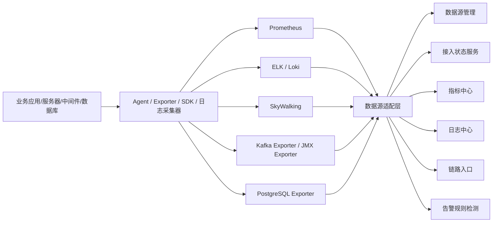
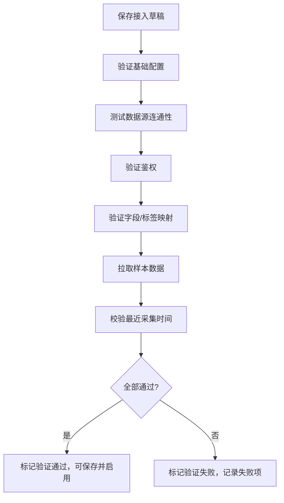

# 数据源接入适配详细设计

## 1. 设计目标

数据源适配层屏蔽 Prometheus/Grafana、SkyWalking、ELK/Loki、Agent、Kafka Exporter/JMX Exporter、PostgreSQL Exporter 的差异，向平台提供统一的监控对象、指标、日志、链路入口、接入状态和采集异常模型。

## 2. 适配模块

| 模块 | 职责 |
| --- | --- |
| DataSource Registry | 管理数据源类型、连接信息、状态和密钥引用 |
| Adapter Client | 封装不同数据源的查询、分页、超时、鉴权 |
| Access Binding | 维护应用、服务器、Kafka、PostgreSQL 与数据源的绑定 |
| Metric Mapping | 将外部指标映射为平台统一 `metric_code` |
| Health Checker | 定时检测数据源、Agent、Exporter 和最近采集时间 |
| Rate Limit & Timeout | 控制查询频率、超时、重试和熔断 |
| Exception Handler | 统一异常码、失败原因和展示文案 |
| Audit Logger | 记录配置变更、测试连接、导出和敏感查询 |

## 3. 数据源模型

| 字段 | 说明 |
| --- | --- |
| `source_id` | 数据源 ID |
| `source_name` | 名称 |
| `source_type` | Prometheus、Grafana、SkyWalking、ELK、Loki、Agent、Kafka、PostgreSQL |
| `env` | 环境 |
| `base_url` | 访问地址 |
| `health_check_path` | 健康检查路径 |
| `auth_type` | none、basic、token、aksk、custom |
| `secret_ref` | 密钥引用 |
| `timeout_seconds` | 查询超时 |
| `retry_count` | 重试次数 |
| `rate_limit_qps` | 限流 |
| `status` | enabled、disabled、unhealthy |
| `last_check_at` | 最近检测时间 |
| `last_success_at` | 最近成功时间 |
| `last_error_code` | 最近错误码 |
| `last_error_message` | 最近错误 |

绑定模型保存 `object_id`、`source_id`、`binding_type`、`external_labels`、`mapping_config`、`last_seen_at`、`access_status`、`failure_reason`。

## 4. 接入状态口径

| 状态 | 含义 |
| --- | --- |
| `connected` | 数据源可用、对象绑定成功、最近有采集数据 |
| `not_connected` | 未配置数据源或未绑定对象 |
| `partial_connected` | 仅日志或仅指标接入 |
| `collector_error` | Agent、Exporter 或采集链路异常 |
| `source_unavailable` | 数据源不可访问或鉴权失败 |
| `no_recent_data` | 数据源可用，但对象近期无采集数据 |
| `mapping_invalid` | 标签、索引或字段映射错误 |

未接入、采集异常和业务异常必须分开展示。数据源异常不应触发业务指标告警，只进入接入异常或平台自身告警。

## 5. 适配要求

| 数据源 | 一期能力 | 关键要求 |
| --- | --- | --- |
| Prometheus/Grafana | 指标查询、规则检测、最近采集判断 | 支持 PromQL 模板、标签映射、查询窗口和超时 |
| SkyWalking | 应用、实例、接口、链路入口 | 允许一期只做入口和摘要，链路深查预留 |
| ELK/Loki | 日志检索、上下文、错误聚合 | 支持索引模式、时间字段、级别字段、脱敏策略 |
| Agent | 主机采集、在线状态、版本 | 支持心跳、采集版本、最后上报时间 |
| Kafka | Broker、Topic、Consumer Group 指标 | 通过 Kafka Exporter/JMX Exporter 接入，按应用依赖裁剪 |
| PostgreSQL | 实例、连接、锁、慢 SQL、复制、容量 | 通过 Exporter 接入，SQL 明文默认脱敏 |

## 6. 接入验证流程

## 7. 异常码

| 异常码 | 说明 |
| --- | --- |
| `AUTH_FAILED` | 鉴权失败 |
| `CONNECT_TIMEOUT` | 连接超时 |
| `QUERY_TIMEOUT` | 查询超时 |
| `CONFIG_INVALID` | 配置非法 |
| `NO_DATA` | 无近期数据 |
| `FIELD_MISSING` | 必要字段缺失 |
| `RATE_LIMITED` | 数据源限流 |
| `AGENT_OFFLINE` | Agent 离线 |
| `SOURCE_DISABLED` | 数据源停用 |
| `PARTIAL_FAILURE` | 部分对象采集失败 |

## 8. 安全与验收

密钥只保存 `secret_ref`，测试连接结果不得返回密钥明文。日志查询、SQL 明文、连接串、Token 和 Cookie 必须经过脱敏策略。所有数据源新增、修改、测试连接、启停和删除都写入审计。

验收重点：数据源可配置可测试；应用、服务器、Kafka、PostgreSQL 可绑定；接入状态能区分未接入、采集异常和业务异常；数据源异常不误触发业务告警；日志和 SQL 敏感内容按策略脱敏。
