# 数据库表结构与 ER 详细设计

## 1. 设计原则

PostgreSQL 业务库只保存资产、权限、规则、事件、通知、审计、导出和脱敏策略等管理数据。指标明细由 Prometheus、VictoriaMetrics 或 Thanos 保存，日志明细由 OpenSearch、Elasticsearch 或 Loki 保存，平台库只保存查询配置、聚合摘要和访问控制信息。

一期没有统一 CMDB，因此平台自建轻量资产模型，并允许 Nacos、Agent、手工导入和后续 CMDB 同步共同补全。应用授权是主线权限，服务器、日志、指标、告警和依赖关系的可见范围默认从应用归属和应用授权推导。

所有核心表统一使用 `uuid` 主键、`timestamptz` 时间、`jsonb` 扩展字段、`created_at`、`updated_at`、`deleted_at`。涉及跨业务线的数据表必须保存 `business_line_id`，涉及环境的数据表必须保存 `env`。

## 2. 表分组

| 分组 | 表 | 说明 |
| --- | --- | --- |
| 组织与资产 | `business_line`、`department`、`application`、`application_owner`、`server`、`application_instance`、`app_server_binding` | 业务线、部门、应用、负责人、服务器和部署关系 |
| 监控对象与依赖 | `monitor_object`、`monitor_object_node`、`object_app_dependency`、`object_dependency_edge`、`data_source`、`data_source_binding`、`agent_instance` | 应用、主机、中间件、数据库和采集源的统一抽象 |
| 指标与日志元数据 | `metric_definition`、`metric_series_mapping`、`metric_query_preset`、`log_index_config`、`saved_log_query`、`log_error_signature` | 指标定义、序列映射、日志索引和错误聚合 |
| 用户权限 | `user_account`、`role`、`permission`、`user_role`、`role_permission`、`application_authorization`、`business_line_authorization`、`sensitive_access_grant` | 用户、角色、菜单操作、应用授权和敏感明文授权 |
| 告警 | `alert_rule`、`alert_rule_target`、`alert_event`、`alert_event_snapshot`、`alert_process_record`、`alert_silence`、`alert_escalation_policy` | 规则、事件、处理记录、静默和升级预留 |
| 通知和值班 | `contact_channel`、`notification_channel`、`notification_template`、`notify_policy`、`notify_policy_target`、`duty_group`、`duty_group_member`、`notification_record` | 邮件通知、模板、策略和值班组 |
| 导出脱敏审计 | `mask_policy`、`mask_rule`、`export_task`、`audit_event`、`external_event_outbox` | 脱敏、导出、审计和外部系统扩展 |
| 字典与保留 | `dictionary_item`、`retention_policy` | 状态、类型、级别和保留周期配置 |

## 3. ER 关系

```mermaid
erDiagram
  BUSINESS_LINE ||--o{ APPLICATION : owns
  DEPARTMENT ||--o{ USER_ACCOUNT : contains
  BUSINESS_LINE ||--o{ SERVER : scopes
  APPLICATION ||--o{ APPLICATION_OWNER : has
  USER_ACCOUNT ||--o{ APPLICATION_OWNER : maintains
  APPLICATION ||--o{ APPLICATION_INSTANCE : has
  SERVER ||--o{ APPLICATION_INSTANCE : hosts
  APPLICATION ||--o{ APP_SERVER_BINDING : deployed_on
  SERVER ||--o{ APP_SERVER_BINDING : hosts

  BUSINESS_LINE ||--o{ MONITOR_OBJECT : scopes
  MONITOR_OBJECT ||--o{ MONITOR_OBJECT_NODE : has
  SERVER ||--o{ MONITOR_OBJECT_NODE : runs_on
  MONITOR_OBJECT ||--o{ OBJECT_APP_DEPENDENCY : impacts
  APPLICATION ||--o{ OBJECT_APP_DEPENDENCY : depends_on
  MONITOR_OBJECT ||--o{ OBJECT_DEPENDENCY_EDGE : from_object
  MONITOR_OBJECT ||--o{ OBJECT_DEPENDENCY_EDGE : to_object
  DATA_SOURCE ||--o{ DATA_SOURCE_BINDING : provides
  MONITOR_OBJECT ||--o{ DATA_SOURCE_BINDING : binds

  MONITOR_OBJECT ||--o{ METRIC_DEFINITION : exposes
  METRIC_DEFINITION ||--o{ METRIC_SERIES_MAPPING : maps
  USER_ACCOUNT ||--o{ METRIC_QUERY_PRESET : saves
  APPLICATION ||--o{ LOG_INDEX_CONFIG : configures
  APPLICATION ||--o{ LOG_ERROR_SIGNATURE : aggregates

  USER_ACCOUNT ||--o{ USER_ROLE : assigned
  ROLE ||--o{ USER_ROLE : has
  ROLE ||--o{ ROLE_PERMISSION : grants
  PERMISSION ||--o{ ROLE_PERMISSION : included
  USER_ACCOUNT ||--o{ APPLICATION_AUTHORIZATION : granted
  APPLICATION ||--o{ APPLICATION_AUTHORIZATION : scoped
  USER_ACCOUNT ||--o{ BUSINESS_LINE_AUTHORIZATION : granted
  BUSINESS_LINE ||--o{ BUSINESS_LINE_AUTHORIZATION : scoped

  ALERT_RULE ||--o{ ALERT_RULE_TARGET : targets
  MONITOR_OBJECT ||--o{ ALERT_RULE_TARGET : selected
  ALERT_RULE ||--o{ ALERT_EVENT : triggers
  MONITOR_OBJECT ||--o{ ALERT_EVENT : occurs_on
  APPLICATION ||--o{ ALERT_EVENT : impacts
  ALERT_EVENT ||--o{ ALERT_EVENT_SNAPSHOT : stores
  ALERT_EVENT ||--o{ ALERT_PROCESS_RECORD : tracks
  ALERT_EVENT ||--o{ NOTIFICATION_RECORD : notifies
  NOTIFY_POLICY ||--o{ ALERT_RULE : used_by
  DUTY_GROUP ||--o{ DUTY_GROUP_MEMBER : contains

  MASK_POLICY ||--o{ MASK_RULE : contains
  USER_ACCOUNT ||--o{ SENSITIVE_ACCESS_GRANT : receives
  EXPORT_TASK }o--|| USER_ACCOUNT : created_by
  AUDIT_EVENT }o--|| USER_ACCOUNT : operated_by
```

## 4. 核心表字段

| 表 | 关键字段 | 关键约束 |
| --- | --- | --- |
| `business_line` | `id`、`code`、`name`、`owner_user_id`、`status` | `code` 唯一；用于多业务线独立管理 |
| `application` | `id`、`business_line_id`、`code`、`name`、`architecture_type`、`env`、`status`、`tags` | `business_line_id + code + env` 唯一 |
| `server` | `id`、`business_line_id`、`hostname`、`ip`、`env`、`os_type`、`status`、`owner_user_id` | `ip + env` 唯一，允许共享服务器 |
| `monitor_object` | `id`、`business_line_id`、`object_type`、`object_subtype`、`name`、`env`、`owner_user_id`、`status`、`extra` | 统一表达应用、服务器、Kafka、PostgreSQL 等对象 |
| `data_source` | `id`、`source_type`、`base_url`、`auth_type`、`secret_ref`、`timeout_seconds`、`status`、`last_check_at`、`last_error_code` | 密钥只存引用，不存明文 |
| `metric_definition` | `id`、`object_type`、`metric_code`、`metric_name`、`unit`、`value_type`、`query_template`、`sensitive_level` | `object_type + metric_code` 唯一 |
| `log_index_config` | `id`、`application_id`、`env`、`source_type`、`index_pattern`、`time_field`、`level_field`、`mask_policy_id` | 日志明细不入库 |
| `alert_rule` | `id`、`business_line_id`、`app_id`、`rule_name`、`metric_code`、`operator`、`threshold`、`duration_seconds`、`repeat_interval_seconds`、`notify_policy_id`、`enabled` | 启用前校验对象、指标、数据源、通知目标 |
| `alert_event` | `id`、`dedup_key`、`rule_id`、`object_id`、`app_id`、`severity`、`status`、`trigger_value`、`current_value`、`triggered_at`、`recovered_at`、`closed_at` | 未恢复事件按 `dedup_key` 唯一 |
| `notification_record` | `id`、`alert_event_id`、`channel_type`、`receiver`、`status`、`retry_count`、`sent_at`、`failure_reason` | 保留发送快照 |
| `audit_event` | `id`、`operator_user_id`、`action`、`resource_type`、`resource_id`、`business_line_id`、`app_id`、`client_ip`、`result`、`detail` | 高风险操作必须写入 |
| `export_task` | `id`、`created_by`、`export_type`、`scope_json`、`mask_policy_id`、`status`、`file_ref`、`expired_at` | 导出异步化并受权限、脱敏、审计控制 |

## 5. 索引与分区

| 表 | 索引建议 |
| --- | --- |
| `application` | `(business_line_id, env, status)`、`(code, env)` |
| `server` | `(business_line_id, env, status)`、`(ip, env)` |
| `monitor_object` | `(business_line_id, object_type, object_subtype, env, status)` |
| `data_source_binding` | `(data_source_id, object_id)`、`(object_id, binding_type)` |
| `application_authorization` | `(user_id, application_id, env)` |
| `alert_rule` | `(business_line_id, enabled, status)`、`(app_id, enabled)` |
| `alert_event` | `(business_line_id, status, severity, triggered_at desc)`、`(app_id, status, triggered_at desc)`、`(dedup_key, status)` |
| `notification_record` | `(alert_event_id)`、`(status, next_retry_at)` |
| `audit_event` | `(operator_user_id, operated_at desc)`、`(resource_type, resource_id, operated_at desc)` |
| `export_task` | `(created_by, created_at desc)`、`(status, created_at desc)` |

`alert_event`、`notification_record`、`alert_process_record`、`audit_event`、`export_task` 建议按月分区。告警、通知、审计、导出任务至少保留 12 个月，高风险审计建议保留 24 个月。导出文件保留 7-30 天，超期删除文件但保留任务和审计摘要。

## 6. 敏感与扩展

敏感字段包括 SQL 文本、连接串、Token、Secret、Cookie、Authorization、身份证、手机号、邮箱、地址、订单号、Topic 敏感命名和 IP。业务表默认保存脱敏展示所需配置，明文查看通过 `sensitive_access_grant` 临时授权并写入 `audit_event`。

共享 Kafka、共享 PostgreSQL 和共享服务器通过 `object_app_dependency` 建模，应用负责人只看到与授权应用相关的 Topic、Consumer Group、库、实例摘要和告警；全局指标只对对象负责人、SRE 或管理员开放。
