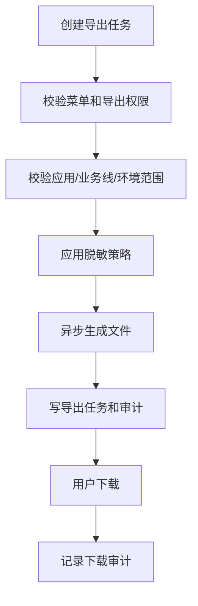
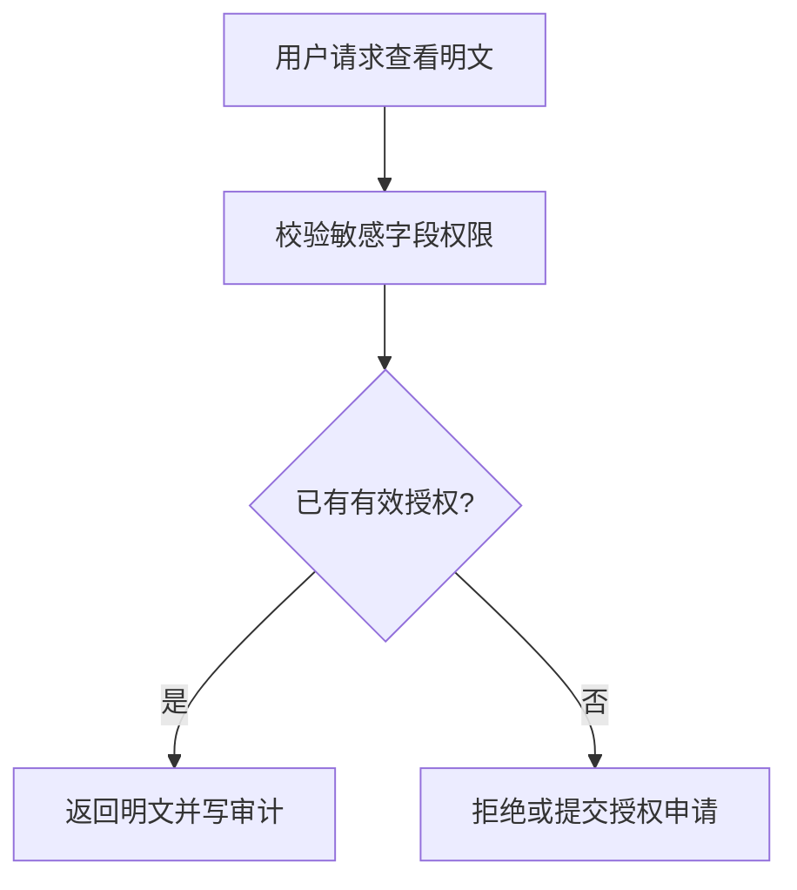

# 邮件通知、审计、导出与脱敏详细设计

## 1. 设计目标

一期通知优先使用邮件，统一记录告警触达、失败重试、导出、审计和脱敏策略。SMS、电话、企业微信、钉钉、IM、Webhook、工单和事件系统只保留扩展模型。

## 2. 邮件通知

邮件渠道字段：

| 字段 | 说明 |
| --- | --- |
| `channel_id` | 渠道 ID |
| `channel_type` | 固定为 `email` |
| `channel_name` | 渠道名称 |
| `smtp_host`、`smtp_port` | SMTP 地址和端口 |
| `security_type` | none、ssl、tls |
| `sender_address`、`sender_name` | 发件人 |
| `auth_type`、`secret_ref` | 鉴权方式和密钥引用 |
| `severity_scope`、`env_scope` | 适用级别和环境 |
| `timeout_seconds` | 超时 |
| `enabled` | 是否启用 |
| `last_test_result`、`last_test_at` | 最近测试结果 |

邮件模板字段包括 `template_code`、`event_type`、`severity_scope`、`subject_template`、`body_template`、`format`、`version`。标题格式示例：

```text
[P1][生产][order-api] 错误率过高 - ALM-20260426-001
```

通知任务和记录应保存接收人快照、规则快照、告警快照和失败原因。重试建议：P0/P1 重试 3 次，间隔 1、3、5 分钟；P2/P3 重试 2 次，间隔 3、10 分钟；恢复通知重试 2 次，间隔 3、10 分钟。

接收人解析顺序：规则指定接收人、监控对象负责人、应用负责人、当前值班人、SRE 兜底组。任何一步解析失败都要记录原因，不能静默丢弃。

## 3. 审计

`audit_event` 记录字段：

| 字段 | 说明 |
| --- | --- |
| `event_id` | 审计 ID |
| `operator_user_id` | 操作人 |
| `action` | 操作类型 |
| `resource_type`、`resource_id` | 资源 |
| `business_line_id`、`app_id` | 数据范围 |
| `client_ip`、`user_agent` | 客户端信息 |
| `request_id` | 请求链路 |
| `before_snapshot`、`after_snapshot` | 前后快照 |
| `result`、`failure_reason` | 结果 |
| `operated_at` | 操作时间 |

必须审计的事件包括登录失败、权限授权、应用授权、数据源新增修改测试、规则新建修改启停、告警确认处理中关闭、导出创建下载、敏感明文查看、脱敏策略修改、通知渠道修改。

## 4. 导出控制

`export_task` 字段包括 `task_id`、`created_by`、`export_type`、`business_line_id`、`app_id`、`scope_json`、`filters_json`、`mask_policy_id`、`status`、`file_ref`、`file_size`、`row_count`、`expired_at`、`failure_reason`。

导出流程：



导出必须限制最大时间范围、最大行数和最大文件大小。日志、告警、审计和 SQL 相关导出默认脱敏。导出文件 7-30 天后删除，任务和审计摘要继续保留。

## 5. 脱敏策略

`mask_policy` 保存策略名称、适用模块、适用业务线、默认动作、启用状态和版本。`mask_rule` 保存字段路径、正则、替换方式、保留位数、优先级和说明。

一期默认规则：

| 类型 | 脱敏建议 |
| --- | --- |
| 手机号 | 保留前 3 后 4 |
| 身份证 | 保留前 6 后 4 |
| 银行卡 | 保留后 4 |
| 邮箱 | 保留首字母和域名 |
| Authorization、Token、Secret、Key | 全量隐藏 |
| Cookie | 隐藏敏感键值 |
| 地址 | 保留省市，隐藏详细地址 |
| 用户 ID、订单号 | 中间隐藏 |
| SQL 文本 | 默认摘要化，明文需授权 |
| DB 连接串 | 隐藏账号、密码、Host 明细 |
| IP | 生产环境默认隐藏末段，平台管理员可看完整 |

## 6. 敏感明文查看

明文查看通过 `sensitive_access_grant` 管理临时授权，字段包括 `user_id`、`resource_type`、`resource_id`、`field_scope`、`reason`、`approved_by`、`expires_at`、`status`。一期可由平台管理员授权，二期可接入审批流。

流程：



## 7. 权限与验收

邮件渠道配置、模板修改、通知重发、导出、脱敏策略和明文查看都需要独立操作权限。应用负责人只能导出授权应用范围内数据，业务线管理员只能导出所属业务线数据，平台管理员跨业务线操作仍需审计。

验收重点：邮件可测试可发送可重试；通知记录可追踪；高风险操作均有审计；日志、SQL、Token、个人信息默认脱敏；导出受权限、范围、脱敏、审计和过期控制；明文查看有授权、有理由、有审计。
