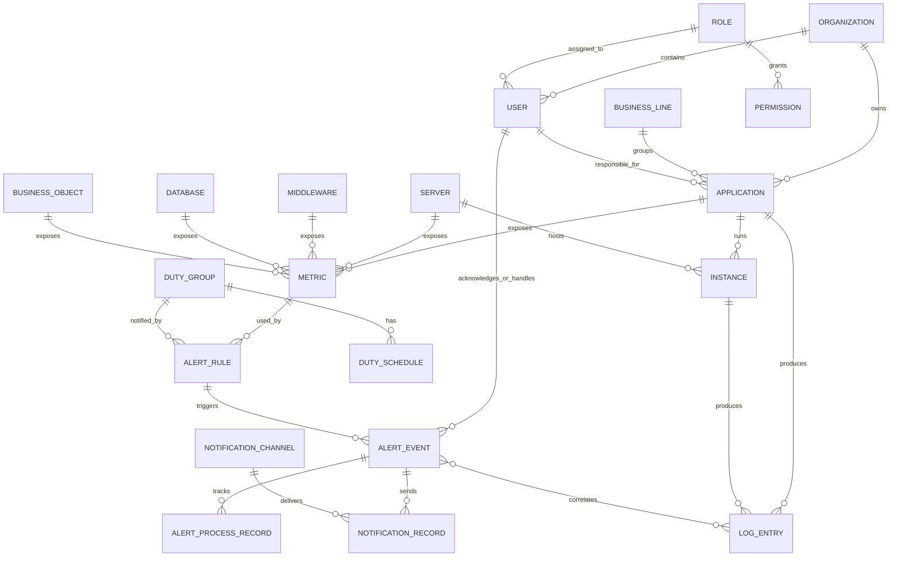
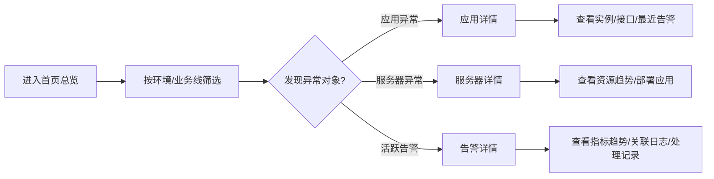
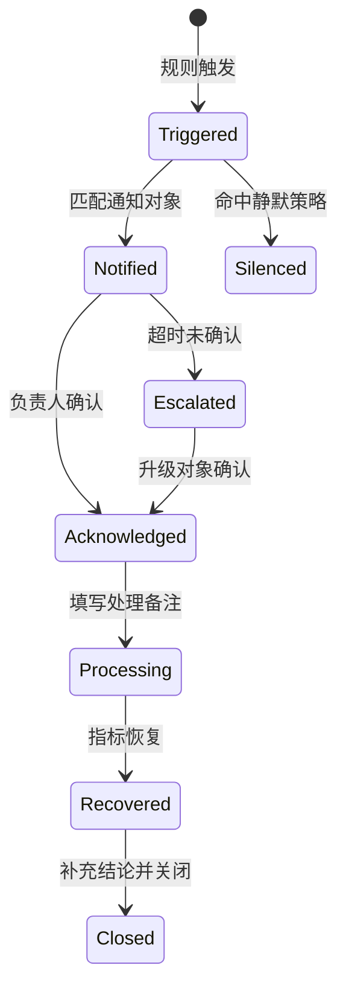

# 企业级统一监控平台信息架构

## 1. 文档定位

本文基于 `demand/monitoring-platform-requirements.md` 编制，用于定义企业级统一监控平台的一期与二期信息组织方式、导航结构、页面层级、核心对象关系、任务路径与权限可见性边界。

信息架构目标：

1. 让不同角色能在 3 次点击内到达高频功能。
2. 将“发现问题、定位问题、通知处理、复盘分析”组织为连续路径。
3. 保持应用、服务器、日志、指标、告警、通知和值班等对象之间可互相跳转。
4. 为一期核心可用版本预留二期闭环增强入口，避免后续大规模重构导航。

一期设计优先级：优先服务应用研发负责人，其次服务运维/SRE，再其次服务业务负责人。首页和详情页的信息排序应优先支持排障定位，而不是管理驾驶舱汇报。

## 2. 目标用户与使用场景

| 目标用户 | 优先级 | 高频使用场景 | 主要入口 | 关键信息诉求 |
| --- | --- | --- | --- | --- |
| 应用研发负责人 | P0 | 查看负责应用状态、实例、日志、接口性能和告警 | 应用监控、日志中心、告警中心、首页总览 | 应用健康、异常实例、Trace ID、错误日志、处理入口 |
| 运维/SRE | P1 | 巡检基础设施、维护告警规则、处理生产故障 | 首页总览、服务器监控、告警中心、指标中心 | 全局健康、异常对象、指标趋势、告警闭环 |
| 业务负责人 | P2 | 查看业务指标、服务可用性、重大告警和报表 | 首页总览、指标中心、报表分析 | 核心业务指标、可用率、严重故障影响 |
| 平台管理员 | P2 | 配置用户、角色、权限、数据源、通知渠道、全局字典 | 系统管理、接入管理、通知管理 | 平台配置完整性、权限隔离、操作审计 |
| 测试人员 | P3 | 在测试/预发环境排查应用日志、接口异常和实例状态 | 应用监控、日志中心、指标中心 | 测试环境日志、接口错误、版本与实例状态 |
| 值班人员 | P3 | 接收告警、确认、处理、升级和补充结论 | 告警中心、通知与值班 | 待确认告警、责任人、关联日志和指标 |

## 3. 导航架构

### 3.1 一级导航

平台建议采用左侧一级导航 + 页面内二级 Tab/侧栏的结构。一级导航按用户任务聚类，而不是按底层数据源聚类。

| 一级导航 | 定位 | 一期/二期 |
| --- | --- | --- |
| 首页总览 | 排障视角的异常入口、影响对象、负责人和处理入口 | 一期 |
| 应用监控 | 应用、实例、接口、依赖与应用告警 | 一期 |
| 服务器监控 | 主机资源、进程端口、部署关联与服务器告警 | 一期 |
| 日志中心 | 日志检索、Trace ID、上下文、错误聚合、保存查询和受控导出 | 一期 |
| 指标中心 | 指标查询、指标详情、基础指标管理 | 一期 |
| 告警中心 | 简单阈值规则、告警事件、告警详情和基础处理闭环 | 一期核心，二期增强 |
| 通知与值班 | 联系人、通知渠道、模板、值班组、通知记录 | 一期支持值班组，二期完善排班和升级 |
| 报表与分析 | 可用性、告警、资源、日志错误和故障分析报表 | 二期 |
| 接入管理 | 应用接入、数据源、Agent、API、Webhook、SSO | 一期核心接入，二期扩展集成 |
| 系统管理 | 用户、角色、权限、组织、字典、审计 | 一期 |

### 3.2 二级导航

| 一级导航 | 二级导航/页面 |
| --- | --- |
| 首页总览 | 全局健康、告警趋势、异常排行、业务指标卡片、环境/业务线/负责人筛选 |
| 应用监控 | 应用列表、应用详情、实例详情、接口指标、依赖状态、应用配置 |
| 服务器监控 | 服务器列表、服务器详情、资源趋势、进程与端口、服务器分组 |
| 日志中心 | 日志查询、Trace ID 查询、日志上下文、错误聚合、保存查询、导出记录 |
| 指标中心 | 指标查询、指标详情、指标对比、指标注册、指标收藏 |
| 告警中心 | 告警列表、告警详情、简单阈值规则、处理记录；静默管理、告警升级二期增强 |
| 通知与值班 | 联系人、负责人配置、通知渠道、通知模板、通知记录、值班组；排班表、升级策略二期增强 |
| 报表与分析 | 可用性报表、告警统计报表、故障分析报表、资源使用报表、日志错误报表、导出任务 |
| 接入管理 | 应用接入、数据源管理、Agent 管理、API 文档、Webhook 集成、SSO 集成 |
| 系统管理 | 用户管理、角色管理、权限管理、组织架构、字典配置、操作审计 |

## 4. 页面层级

```mermaid
flowchart TD
  A["企业级统一监控平台"] --> H["首页总览"]
  A --> APP["应用监控"]
  A --> HOST["服务器监控"]
  A --> LOG["日志中心"]
  A --> METRIC["指标中心"]
  A --> ALERT["告警中心"]
  A --> NOTICE["通知与值班"]
  A --> REPORT["报表与分析"]
  A --> ACCESS["接入管理"]
  A --> SYS["系统管理"]

  H --> H1["全局健康"]
  H --> H2["告警趋势"]
  H --> H3["异常排行"]
  H --> H4["业务指标卡片"]

  APP --> APP1["应用列表"]
  APP1 --> APP2["应用详情"]
  APP2 --> APP3["实例详情"]
  APP2 --> APP4["接口指标"]
  APP2 --> APP5["依赖状态"]
  APP2 --> APP6["最近告警"]

  HOST --> HOST1["服务器列表"]
  HOST1 --> HOST2["服务器详情"]
  HOST2 --> HOST3["资源趋势"]
  HOST2 --> HOST4["进程与端口"]
  HOST2 --> HOST5["部署应用"]

  LOG --> LOG1["日志查询"]
  LOG1 --> LOG2["日志上下文"]
  LOG --> LOG3["日志统计"]
  LOG --> LOG4["保存查询"]

  METRIC --> METRIC1["指标查询"]
  METRIC1 --> METRIC2["指标详情"]
  METRIC --> METRIC3["指标对比"]
  METRIC --> METRIC4["指标注册"]

  ALERT --> ALERT1["告警列表"]
  ALERT1 --> ALERT2["告警详情"]
  ALERT --> ALERT3["告警规则"]
  ALERT --> ALERT4["静默管理"]
  ALERT --> ALERT5["升级策略"]

  NOTICE --> NOTICE1["联系人"]
  NOTICE --> NOTICE2["通知渠道"]
  NOTICE --> NOTICE3["通知模板"]
  NOTICE --> NOTICE4["通知记录"]
  NOTICE --> NOTICE5["值班组"]
  NOTICE --> NOTICE6["排班表"]

  REPORT --> REPORT1["可用性报表"]
  REPORT --> REPORT2["告警报表"]
  REPORT --> REPORT3["资源报表"]
  REPORT --> REPORT4["日志报表"]

  ACCESS --> ACCESS1["应用接入"]
  ACCESS --> ACCESS2["数据源"]
  ACCESS --> ACCESS3["Agent"]
  ACCESS --> ACCESS4["API 文档"]
  ACCESS --> ACCESS5["Webhook"]

  SYS --> SYS1["用户"]
  SYS --> SYS2["角色"]
  SYS --> SYS3["权限"]
  SYS --> SYS4["组织"]
  SYS --> SYS5["审计日志"]
```

## 5. 核心对象关系

平台核心对象以“监控对象”为中心展开。应用、服务器、中间件、数据库和业务指标都可以作为监控对象进入指标、规则、告警、日志和报表链路。

核心对象说明：

| 对象 | 信息架构定位 | 主要关联 |
| --- | --- | --- |
| 应用 | 业务系统监控入口，也是日志、指标、告警的主过滤维度 | 实例、负责人、服务器、日志、指标、告警 |
| 实例 | 应用运行单元，用于定位具体 IP、端口、版本和健康状态 | 应用、服务器、日志、指标 |
| 服务器 | 基础设施监控入口，可反向查看部署应用 | 应用实例、资源指标、告警 |
| 指标 | 告警规则和趋势分析的数据基础 | 监控对象、规则、报表 |
| 告警规则 | 指标阈值、检测周期、通知对象和静默策略配置 | 指标、监控对象、通知渠道 |
| 告警事件 | 故障处理闭环核心对象 | 规则、通知、日志、指标、处理记录 |
| 日志 | 故障定位证据，可从告警、应用、实例进入 | 应用、实例、告警、Trace ID |
| 联系人与值班 | 告警通知对象解析基础 | 用户、应用负责人、值班组、通知记录 |
| 权限 | 决定菜单、操作、应用、环境和数据范围可见性 | 用户、角色、组织、应用、环境 |

## 6. 核心任务路径

### 6.1 全局巡检路径

### 6.2 应用故障定位路径

1. 从首页异常应用、应用列表或告警详情进入应用详情。
2. 查看应用健康、实例状态、接口指标、依赖状态和最近告警。
3. 若定位到异常实例，进入实例详情查看 IP、端口、版本、启动时间和健康状态。
4. 从实例或告警上下文跳转到日志中心，自动带入应用、环境、实例 IP 和时间范围。
5. 从日志结果跳转回指标详情、告警详情或应用详情，形成闭环。

### 6.3 告警处理路径

页面路径：

1. 告警列表根据级别、状态、应用、负责人和时间筛选待处理告警。
2. 告警详情展示触发规则、触发值、影响对象、通知记录、处理记录、关联日志和指标趋势。
3. 值班人员执行确认、处理、转派、升级、静默或关闭操作。
4. 告警恢复后进入报表统计和故障分析。

### 6.4 新应用接入路径

1. 应用负责人在接入管理提交应用接入申请。
2. 平台管理员或运维审核应用信息。
3. 配置应用基础信息、环境、实例、负责人和健康检查。
4. 接入指标、日志和默认告警规则。
5. 在应用详情、指标查询和日志查询中验证数据采集状态。
6. 正式纳入首页、告警中心和报表统计。

### 6.5 日志查询路径

1. 用户进入日志中心，选择应用、环境、实例、时间范围、日志级别和关键字。
2. 查询结果支持高亮、堆栈折叠、上下文查看。
3. 用户可通过 Trace ID、Request ID、用户 ID 或订单号继续缩小范围。
4. 结果可跳转到应用详情、实例详情、告警详情或指标趋势。
5. 日志导出、保存查询和敏感字段查看受权限控制。

## 7. 权限视角下的信息可见性

一期权限模型以“应用授权”为核心，菜单权限和操作权限控制能进入哪里、能做什么；应用数据权限控制能看到哪些应用，并由应用关系衍生日志、指标、告警和关联服务器的可见范围。环境和敏感数据权限作为附加约束，不作为一期主授权维度。

| 角色 | 默认可见范围 | 可执行操作 | 受控/不可见信息 |
| --- | --- | --- | --- |
| 平台管理员 | 全部菜单、全部应用、全部环境、全部审计 | 用户角色、权限、数据源、通知渠道、字典、审计、全局配置 | 敏感日志明文仍需按安全策略授权 |
| 运维/SRE | 基础设施、应用、日志、指标、告警、接入配置 | 配置告警规则、处理告警、查看生产数据、维护服务器和数据源 | 权限变更需管理员授权 |
| 应用研发负责人 | 自己负责或被授权的应用、实例、日志、指标和告警 | 查看详情、查询日志、处理本应用告警、维护部分应用配置 | 非授权应用日志、生产敏感字段、全局权限配置 |
| 业务负责人 | 授权业务线的业务指标、可用性、重大告警和报表 | 查看业务报表、订阅重大告警、导出授权报表 | 技术日志明细、服务器敏感配置、规则修改 |
| 测试人员 | 测试/预发环境授权应用、日志和指标 | 查询测试日志、查看实例和接口异常 | 生产环境日志和指标、告警规则修改 |
| 值班人员 | 值班组覆盖范围内的告警、关联对象和处理记录 | 确认、处理、备注、转派、升级 | 非值班范围数据、系统配置 |
| 只读用户 | 授权范围内看板、列表和详情 | 查看与筛选 | 导出、规则修改、告警处理、权限配置 |

信息可见性规则：

1. 菜单可见性由角色控制；菜单可见不代表数据全量可见。
2. 应用、日志、指标、告警优先按应用授权过滤；服务器数据通过部署应用或负责人关系补充控制。
3. 多业务线独立管理作为一期组织隔离要求；业务线与应用授权共同决定默认可见范围。
4. 生产环境数据默认高于测试/预发环境权限要求，但仍以应用授权为主线。
5. 日志导出、敏感字段明文查看、告警规则修改、权限变更、报表导出必须记录审计。
6. 告警详情允许查看必要的关联日志和指标，但范围应限制在告警对象和告警时间窗口附近。

## 8. 一期/二期导航边界

### 8.1 一期核心可用版本

一期目标是完成“看见状态、定位问题、触发通知、基础权限隔离”。一期页面范围按本章节一级导航中标记为一期的导航执行。

| 导航 | 一期范围 |
| --- | --- |
| 首页总览 | 排障视角首页、核心统计、活跃告警、待处理问题、异常排行、基础筛选 |
| 应用监控 | 应用列表、应用详情、实例信息、接口指标、最近告警 |
| 服务器监控 | 服务器列表、服务器详情、资源趋势、进程与端口 |
| 日志中心 | 日志查询、Trace ID、上下文查看、错误堆栈、错误聚合、受控导出、从告警跳转日志 |
| 指标中心 | 基础指标查询、指标详情、指标注册、指标作为规则数据源 |
| 告警中心 | 简单阈值规则、告警列表、告警详情、通知记录、基础处理备注 |
| 通知与值班 | 联系人、负责人配置、通知渠道、通知模板、通知记录、值班组 |
| 接入管理 | 应用接入、Prometheus/Grafana、SkyWalking、未接入应用状态、Agent、API 接入基础能力 |
| 系统管理 | 用户、角色、菜单权限、操作权限、应用数据权限、审计 |

### 8.2 二期闭环增强版本

二期目标是提升告警处理闭环、报表复盘和专项监控能力。

| 导航 | 二期范围 |
| --- | --- |
| 告警中心 | 复杂组合规则、告警确认、处理、转派、升级、恢复、合并、静默 |
| 通知与值班 | 排班表、节假日规则、失败重试、无人确认升级 |
| 报表与分析 | 可用性报表、告警统计、故障分析、资源预测、日志错误报表 |
| 应用监控 | 依赖状态增强、中间件/数据库关联视图 |
| 指标中心 | 指标对比、同比环比、聚合分析、业务指标接入 |
| 接入管理 | Webhook、SSO、外部系统集成增强 |
| 服务器监控 | 容量趋势、分组分析和更细的资源报表入口 |

### 8.3 导航预留策略

1. 二期导航项可在一期以“无权限/建设中”方式隐藏，不建议暴露空页面。
2. 一期告警详情应预留处理记录、通知记录、关联日志、指标趋势区块位置。
3. 报表与分析可在一期不作为一级导航展示，但明细页应保留“进入统计分析”的跳转点。
4. 值班管理二期完善前，一期可先落在“通知与值班”下的负责人配置和通知记录。

## 9. 跨页面跳转关系

跨页面跳转应围绕监控对象、时间范围、环境和筛选条件传递上下文。

| 起点 | 触发元素 | 目标页 | 带入上下文 |
| --- | --- | --- | --- |
| 首页总览 | 异常应用卡片/TOP 异常应用 | 应用详情 | 应用、环境、时间范围 |
| 首页总览 | 异常服务器卡片/TOP 高负载服务器 | 服务器详情 | 服务器、环境、时间范围 |
| 首页总览 | 活跃告警数量/告警趋势点 | 告警列表 | 告警状态、级别、时间范围、环境 |
| 应用列表 | 应用名称 | 应用详情 | 应用、环境 |
| 应用详情 | 实例 IP | 实例详情 | 应用、实例、环境 |
| 应用详情 | 最近告警 | 告警详情 | 告警 ID |
| 应用详情 | 接口指标曲线 | 指标详情 | 应用、接口、指标、时间范围 |
| 应用详情 | 查看日志 | 日志查询 | 应用、环境、实例、时间范围 |
| 服务器详情 | 部署应用 | 应用详情 | 应用、服务器、环境 |
| 服务器详情 | 资源指标曲线 | 指标详情 | 服务器、指标、时间范围 |
| 日志查询 | Trace ID/Request ID | 日志查询 | Trace ID、时间范围、应用 |
| 日志查询 | 关联告警 | 告警详情 | 告警 ID |
| 指标详情 | 创建告警规则 | 告警规则编辑 | 指标、监控对象、环境 |
| 告警列表 | 告警标题 | 告警详情 | 告警 ID |
| 告警详情 | 影响对象 | 应用详情/服务器详情 | 监控对象、环境、时间范围 |
| 告警详情 | 关联日志 | 日志查询 | 应用/实例、告警触发时间前后窗口 |
| 告警详情 | 指标趋势 | 指标详情 | 指标、监控对象、触发时间窗口 |
| 告警详情 | 通知记录 | 通知记录详情/列表 | 告警 ID、接收人、渠道 |
| 告警规则 | 通知对象 | 联系人/值班组 | 用户、值班组、渠道 |
| 报表与分析 | 高频故障应用 | 应用详情 | 应用、统计周期 |
| 报表与分析 | 高频告警规则 | 告警规则详情 | 规则 ID、统计周期 |
| 接入管理 | 接入应用 | 应用详情 | 应用、环境、接入状态 |
| 系统管理 | 用户授权应用 | 应用列表 | 用户、授权范围 |

## 10. 关键页面信息结构

### 10.1 首页总览

1. 顶部筛选：环境、业务线、部门、应用负责人、时间范围。
2. 待处理问题区：P0/P1 告警、异常应用、异常接口、负责人、持续时间、快捷处理入口。
3. 健康状态区：全局健康、应用总数、在线应用、异常应用、服务器总数、异常服务器。
4. 告警态势区：活跃告警、级别分布、最近 24 小时趋势。
5. 异常排行区：TOP 异常应用、TOP 高负载服务器、TOP 慢接口。
6. 业务指标区：订单量、支付成功率、任务积压量等核心指标卡片。

### 10.2 应用详情

1. 基本信息：名称、编码、业务线、部门、负责人、仓库地址、部署环境。
2. 运行状态：健康状态、实例数量、最近发布时间、启动时间。
3. 实例列表：IP、端口、版本、运行时长、健康状态。
4. 性能指标：请求量、错误率、平均响应时间、P95、P99。
5. 运行时指标：JVM/线程池/连接池等按技术栈展示。
6. 依赖状态：数据库、缓存、MQ、第三方服务。
7. 关联信息：最近告警、日志入口、指标入口。

### 10.3 告警详情

1. 告警摘要：标题、级别、状态、影响对象、触发时间、负责人。
2. 触发信息：规则、指标、触发值、阈值、持续时间、检测周期。
3. 定位信息：指标趋势、关联日志、影响实例、影响依赖。
4. 通知信息：通知对象、渠道、发送状态、失败原因、重试记录。
5. 处理信息：确认人、处理人、处理备注、转派、升级、恢复、关闭。
6. 审计信息：状态变更记录、操作人、操作时间。

## 11. 设计约束与后续确认项

设计约束：

1. 所有列表页应统一支持环境、时间范围、应用/服务器/负责人等核心筛选模式。
2. 所有详情页应提供返回上游列表、跳转关联日志、跳转指标趋势和查看关联告警的能力。
3. 涉及导出、敏感日志、规则修改和权限变更的操作必须进入审计日志。
4. 一期避免把中间件、数据库、业务指标拆成过多一级导航，可先通过指标中心、应用依赖和报表入口承载。
5. 一期暂无统一应用资产库和 CMDB，信息架构需支持平台内置应用资产维护，并预留后续外部资产同步。
6. 一期通知渠道优先邮件，通知与值班模块需保持渠道可扩展。
7. 一期支持多业务线独立管理，业务线应作为导航筛选、权限范围和报表统计的重要维度。
8. 工单、事件管理系统和 IM 机器人一期不接入，但告警详情和处理记录应预留外部事件扩展点。

已确认前置结论：

1. 暂无统一应用资产库和统一 CMDB，应用与负责人信息分散维护。
2. 一期通知渠道优先使用邮件。
3. 日志至少保留 1 个月，部分应用可保留 1 年；敏感字段脱敏规则需可配置。
4. 需要支持多业务线独立管理。
5. 一期不接入工单、事件管理系统或 IM 机器人，但预留扩展。
6. 一期优先接入 ACE、iPro、CMS 等核心应用，约 20 台服务器，覆盖 Kafka、PostgreSQL，业务指标围绕物流、采购梳理。
