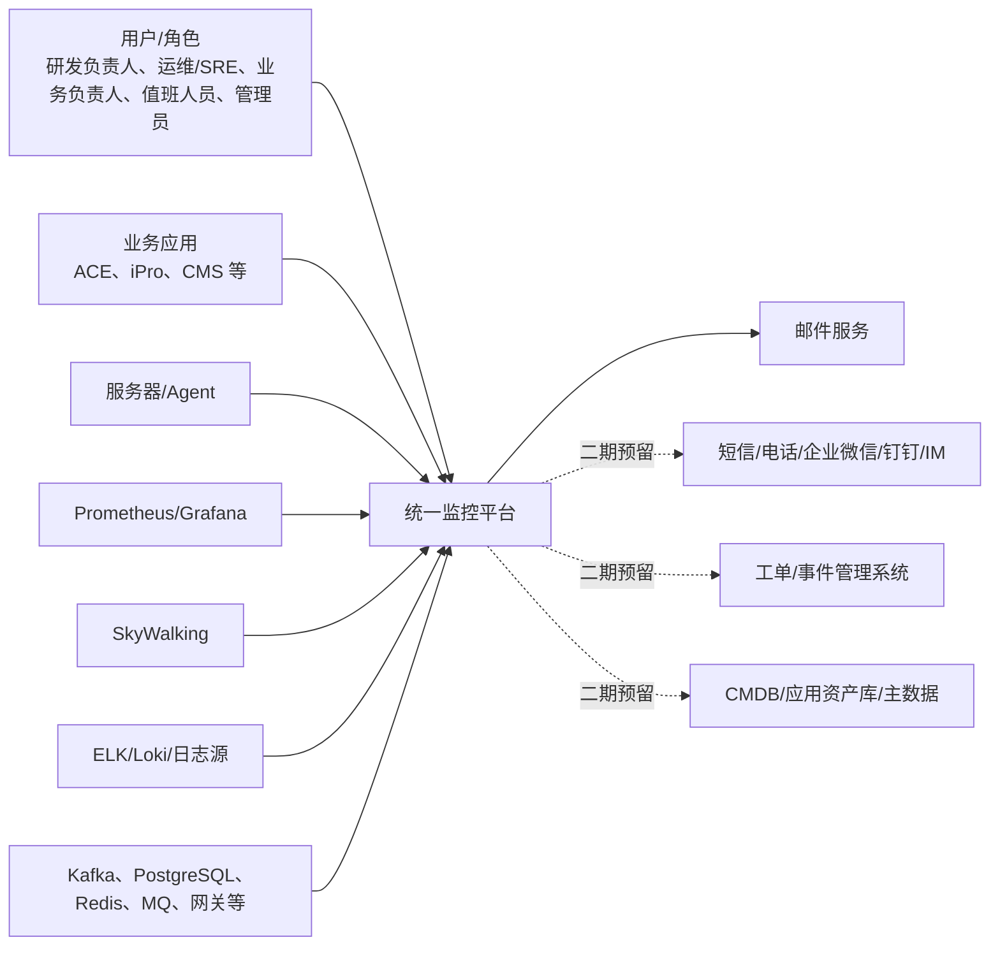
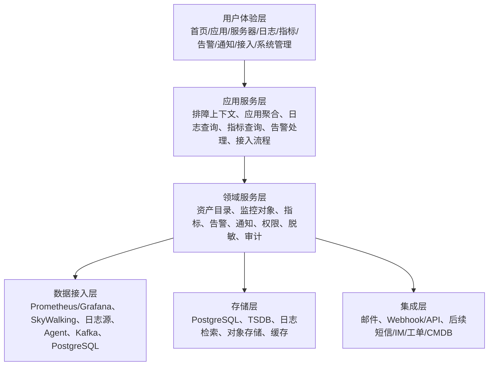
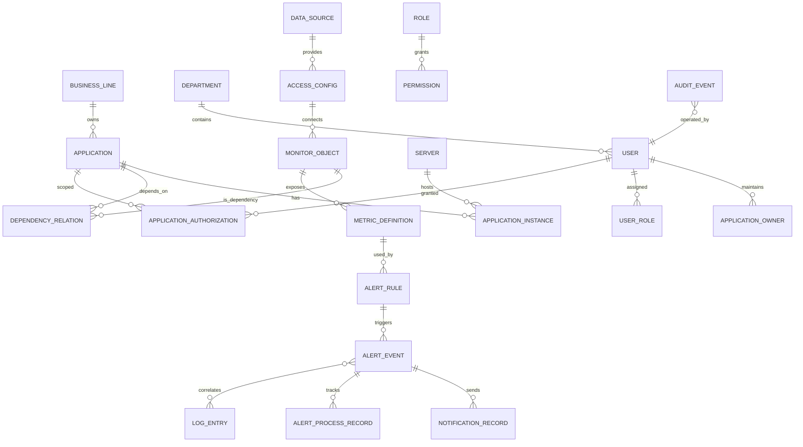
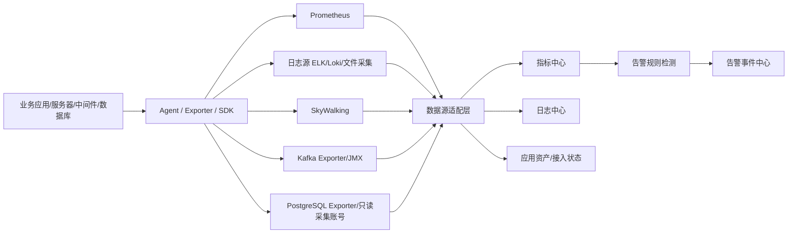
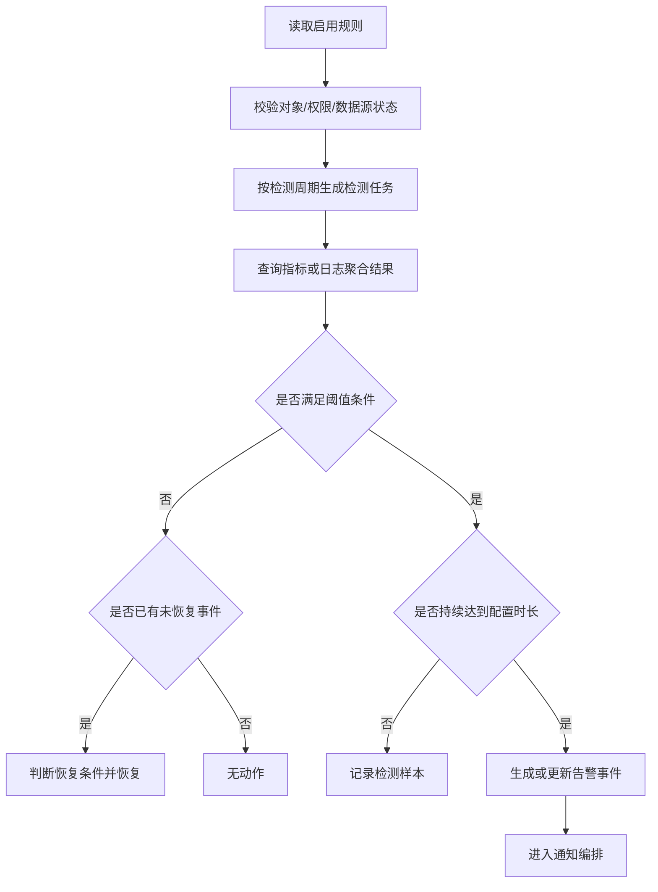
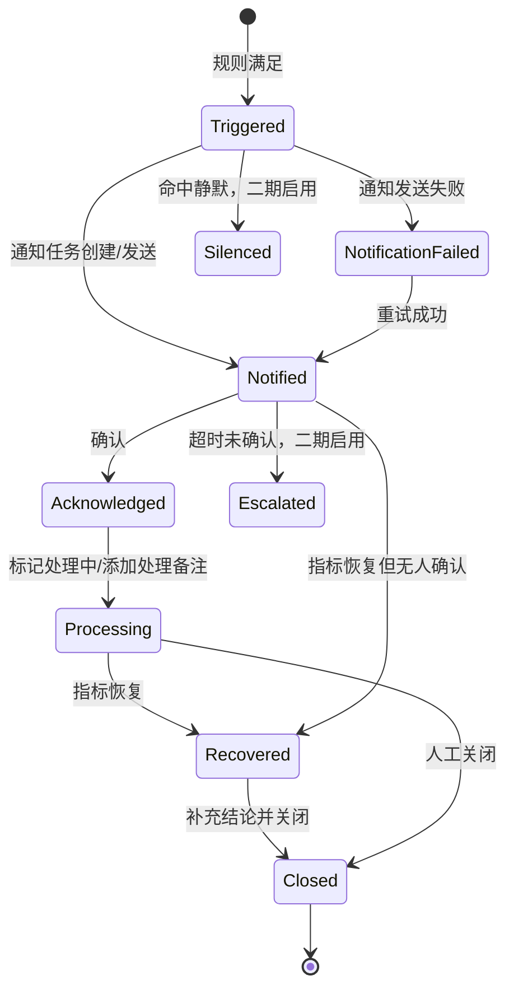
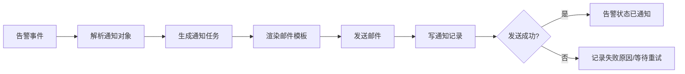

# 企业级统一监控平台技术架构设计

## 1. 文档定位

本文基于以下输入，输出企业级统一监控平台一期技术架构设计：

- `demand/monitoring-platform-requirements.md`
- `architecture/information-architecture.md`
- `architecture/architecture-prerequisites.md`
- `product-prototype/README.md`
- `product-prototype/core-troubleshooting/core-troubleshooting-prototype.md`
- `product-prototype/config-management/config-management-prototype.md`
- `product-prototype/list-and-states/list-and-states-prototype.md`
- `middleware-db-monitoring/requirements-architecture/middleware-db-requirements-architecture.md`

本文用于指导后续接口设计、数据库设计、采集方案、权限模型、告警规则引擎、通知链路、日志/指标存储和实施排期。

## 2. 架构目标与约束

### 2.1 一期目标

一期围绕“看见状态、定位问题、触发通知、基础权限隔离”建设，优先服务应用研发负责人，其次服务运维/SRE、值班人员和业务负责人。

一期技术架构应支撑：

1. ACE、iPro、CMS 等核心应用接入。
2. 约 20 台服务器基础资源和 Agent 状态监控。
3. Kafka、PostgreSQL 等关键中间件/数据库接入。
4. Prometheus/Grafana、少量 SkyWalking、日志源和 Agent 接入状态管理。
5. 首页、应用、服务器、日志、指标、告警、通知与值班、接入管理、系统管理核心链路。
6. 单指标简单阈值告警规则、告警事件状态机和邮件通知。
7. 应用授权、多业务线独立管理、敏感字段脱敏、导出控制和统一审计。

### 2.2 前置决策

| 编号 | 主题 | 技术约束 |
| --- | --- | --- |
| AD-01 | 应用资产与 CMDB | 暂无统一应用资产库和统一 CMDB，一期平台需要内置轻量资产目录 |
| AD-02 | 负责人来源 | 负责人信息分散维护，一期支持平台维护、批量导入和后续外部同步 |
| AD-03 | 通知渠道 | 一期优先邮件，短信、电话、IM、Webhook 作为扩展预留 |
| AD-04 | 日志保留 | 日志至少保留 1 个月，部分低频应用可保留 1 年 |
| AD-05 | 敏感字段脱敏 | 脱敏规则暂无公司统一文件，需可配置、可审计、可扩展 |
| AD-06 | 组织隔离 | 支持多业务线独立管理，不做完整多租户 |
| AD-07 | 外部集成 | 一期不接入工单/事件/IM 机器人，但事件模型和接口预留 |
| AD-08 | 一期接入范围 | ACE、iPro、CMS，约 20 台服务器，Kafka、PostgreSQL |
| AD-09 | 业务指标 | 优先围绕物流、采购业务指标梳理 |

### 2.3 架构原则

1. 以应用资产为主线：应用是日志、指标、告警、负责人、权限和排障上下文的核心聚合点。
2. 以监控对象泛化扩展：应用、服务器、中间件、数据库、业务指标统一抽象为监控对象。
3. 以告警事件驱动闭环：告警事件串联规则、指标证据、日志证据、通知记录、处理记录和审计事件。
4. 以应用授权为一期权限核心：菜单权限、操作权限、业务线范围和敏感权限叠加在应用数据权限之上。
5. 以接入状态区分业务异常：未接入、仅日志、仅指标、采集异常、未知状态不应误判为业务正常或业务异常。
6. 以分层存储承载不同负载：关系库不承载大规模日志和指标明细，日志和指标进入专用存储。
7. 以可扩展集成为边界：一期不实现工单、IM、事件管理正式集成，但保留事件出口。

## 3. 系统上下文



一期平台作为轻量资产目录和监控入口，内部维护应用、负责人、业务线、环境、服务器、接入状态、数据源绑定和告警规则。未来可通过预留字段对接外部 CMDB、主数据、工单、事件管理和 IM 机器人。

## 4. 总体逻辑架构



| 层级 | 职责 |
| --- | --- |
| 用户体验层 | 承载产品原型中的各页面与操作入口 |
| 应用服务层 | 编排跨领域流程，例如告警详情聚合日志、指标、通知、处理记录 |
| 领域服务层 | 实现核心业务能力和规则，例如资产、权限、告警、通知、审计 |
| 数据接入层 | 屏蔽具体外部数据源差异，统一映射为监控对象、指标、日志和接入状态 |
| 存储层 | 按数据类型选择合适存储，支撑查询、保留、审计和归档 |
| 集成层 | 对接邮件服务，一期预留外部事件、Webhook、工单、IM、CMDB |

## 5. 模块划分

### 5.1 核心业务模块

| 模块 | 一期职责 | 主要领域对象 |
| --- | --- | --- |
| 首页总览 | 按授权范围展示整体健康、待处理问题、异常排行、业务指标入口 | 健康摘要、待处理问题、排障上下文 |
| 应用监控 | 展示应用、实例、接口、运行时指标、依赖、最近告警 | 应用、实例、接口、依赖关系、接入状态 |
| 服务器监控 | 展示服务器资源、进程端口、部署应用、主机告警 | 服务器、资源指标、部署关系 |
| 日志中心 | 日志检索、Trace ID、上下文、错误聚合、受控导出 | 日志记录、日志查询、错误签名、导出任务 |
| 指标中心 | 指标注册、趋势查询、指标详情、告警规则数据源 | 指标定义、指标序列、指标标签、数据源 |
| 告警中心 | 简单阈值规则、告警事件、告警详情、基础处理记录 | 告警规则、告警事件、处理记录 |
| 通知与值班 | 联系人、负责人、通知渠道、模板、通知记录、值班组 | 联系人、通知渠道、通知模板、值班组 |
| 接入管理 | 应用接入、数据源、Agent、接入状态、默认规则模板 | 接入配置、数据源、Agent、采集状态 |
| 系统管理 | 用户、角色、菜单权限、操作权限、应用授权、审计 | 用户、角色、权限、审计事件 |

### 5.2 技术支撑模块

| 模块 | 职责 |
| --- | --- |
| 权限与数据范围服务 | 统一处理角色、菜单、操作、应用授权、业务线隔离、环境约束、敏感权限 |
| 脱敏策略服务 | 对日志、导出、复制、敏感明细查看进行字段级脱敏和审计 |
| 审计事件服务 | 记录告警处理、规则修改、权限变更、接入变更、导出、敏感查看和越权访问 |
| 通知分发服务 | 渠道无关地处理通知模板、接收人解析、发送记录、失败原因和后续重试扩展 |
| 排障上下文服务 | 在首页、告警、日志、应用、指标之间传递应用、环境、实例、时间窗口、Trace ID |
| 数据源适配服务 | 统一封装 Prometheus、SkyWalking、日志源、Agent、Kafka、PostgreSQL 访问 |
| 规则检测服务 | 周期性执行启用规则，生成/恢复告警事件，并触发通知编排 |

## 6. 核心领域模型



| 对象 | 定义 | 关键字段 |
| --- | --- | --- |
| Application | 平台的一期核心资产和权限主线 | 应用编码、名称、业务线、部门、环境、负责人、技术栈、仓库地址、健康检查、接入状态 |
| ApplicationInstance | 应用运行单元 | 实例 IP、端口、版本、启动时间、健康状态、所在服务器 |
| Server | 基础设施监控对象 | 主机名、IP、环境、区域、负责人、Agent 状态、资源指标 |
| MonitorObject | 泛化的被监控对象 | 对象类型、子类型、名称、环境、业务线、负责人、关联应用、部署节点、接入状态 |
| DependencyRelation | 应用与数据库、中间件、第三方服务的关系 | 应用、依赖对象、方向、环境、是否核心依赖、影响范围 |
| MetricDefinition | 指标元数据和查询入口 | 指标编码、名称、类型、单位、对象类型、采集周期、数据源、标签 |
| MetricSeries | 时序指标数据 | 指标编码、对象、标签、时间戳、值、采样粒度 |
| LogEntry | 应用或对象产生的日志 | 应用、环境、实例、时间、级别、Trace ID、Request ID、内容、脱敏标识 |
| ErrorSignature | 错误聚合结果 | 异常类型、关键堆栈、错误摘要、影响应用、次数、首次/最近出现 |
| AlertRule | 告警检测配置 | 对象类型、对象范围、指标、条件、阈值、持续时间、检测周期、级别、通知对象、渠道 |
| AlertEvent | 告警闭环核心对象 | 规则、状态、级别、对象、触发值、当前值、触发时间、恢复时间、负责人 |
| AlertProcessRecord | 告警生命周期操作记录 | 告警、动作、操作人、备注、状态变更、时间 |
| NotificationRecord | 告警通知发送记录 | 告警、渠道、接收人、模板、发送状态、失败原因、重试次数 |
| Contact | 通知对象基础信息 | 用户账号、姓名、部门、手机号、邮箱、IM 账号、状态 |
| DutyGroup | 规则通知对象和责任兜底 | 业务线、覆盖应用、成员、当前值班人、备份联系人、状态 |
| DataSource | 外部采集或查询源 | 类型、地址、环境、鉴权方式、状态、最近检查 |
| AccessConfig | 应用或对象与数据源的绑定 | 对象、数据源、日志源、指标源、Trace 源、Agent、验证状态 |
| Permission | 菜单、操作、数据和敏感权限 | 权限编码、类型、资源、动作 |
| ApplicationAuthorization | 用户或角色的数据范围 | 授权主体、应用、业务线、环境、授权来源 |
| MaskingPolicy | 敏感字段处理规则 | 字段类型、匹配规则、脱敏方式、适用场景、审计要求 |
| AuditEvent | 高风险操作和关键变更记录 | 操作人、动作、对象、前后值、结果、时间、来源 IP |

## 7. 边界上下文

| 上下文 | 职责 | 一期边界 |
| --- | --- | --- |
| 应用资产上下文 | 应用、业务线、负责人、环境、服务器、实例、依赖关系、接入状态 | 平台作为主数据维护源，支持手工维护和批量导入，预留外部 CMDB 同步字段 |
| 监控数据上下文 | 指标、日志、Trace、采集状态和数据质量 | 指标、日志、Trace 分别进入专用存储，业务库仅保存元数据和引用 |
| 告警上下文 | 规则配置、检测、事件生成、状态流转、处理记录和证据聚合 | 一期仅支持单指标简单阈值规则 |
| 通知和值班上下文 | 接收人解析、渠道配置、模板、发送记录和值班组 | 邮件正式落地，多渠道模型预留；值班组先支持基础成员和当前值班人 |
| 权限与安全上下文 | 用户、角色、菜单权限、操作权限、应用授权、业务线隔离、敏感字段权限、审计 | 权限判断采用组合模型，所有查询和导出必须后端过滤 |
| 接入管理上下文 | 应用、服务器、中间件、数据库、数据源、Agent 的接入状态和采集配置 | 未接入、仅日志、仅指标、采集异常、验证中作为一等状态 |
| 报表分析上下文 | 可用性、告警、资源、日志错误和故障分析 | 一期不作为核心交付，保留事件和聚合数据基础 |

## 8. 权限与数据范围模型

一期采用“角色 + 应用授权 + 业务线隔离 + 操作权限 + 环境约束 + 敏感字段权限”的组合模型。

```text
最终可访问范围 =
  菜单权限
  ∩ 操作权限
  ∩ 应用授权范围
  ∩ 业务线范围
  ∩ 环境约束
  ∩ 敏感字段权限
```

| 数据类型 | 授权规则 |
| --- | --- |
| 应用详情 | 仅授权应用可见 |
| 日志 | 仅授权应用日志可查，敏感字段另行控制 |
| 指标 | 授权应用及其实例指标可见 |
| 告警 | 授权应用相关规则和事件可见 |
| 服务器 | 部署授权应用的服务器摘要可见；进程、端口等敏感信息需额外权限 |
| 中间件/数据库 | 应用专属对象可见；共享对象只展示授权应用相关影响信息 |
| 业务指标 | 按业务线、应用、指标负责人和角色组合过滤 |

后端必须在搜索、下拉、列表、统计、详情、导出、URL 直访等路径统一执行权限过滤。无权限时不泄露应用名称、对象名称、日志内容、SQL、Topic、连接串、未授权数量等敏感信息。

## 9. 数据架构与存储设计

### 9.1 数据分层

| 数据类型 | 推荐存储 | 说明 |
| --- | --- | --- |
| 应用资产、服务器、负责人、权限、规则、通知配置 | PostgreSQL | 强一致、关系清晰、便于权限过滤和审计追踪 |
| 指标明细与聚合指标 | Prometheus / VictoriaMetrics / Thanos | 承载服务器、应用、Kafka、PostgreSQL、业务指标的时序查询 |
| 应用日志与错误聚合 | OpenSearch/Elasticsearch 或 Loki | 支持关键字、Trace ID、上下文、错误聚合和导出 |
| 告警事件、通知记录、处理记录、导出记录、审计事件 | PostgreSQL 为主，必要时异步写入 Kafka | 作为闭环事实记录，要求可追溯、可统计、可导出 |
| 冷日志、长期导出文件、报表快照 | 对象存储或低成本归档盘 | 支持 1 年低频日志、导出文件留存和审计取证 |
| 高频会话、权限缓存、规则检测锁 | Redis 或等价缓存 | 缓解热点查询，支持短 TTL 缓存和分布式锁 |

### 9.2 关系库核心表建议

#### 应用资产与服务器

| 实体 | 核心字段 |
| --- | --- |
| `application` | `id`、`app_code`、`app_name`、`system_name`、`business_line_id`、`department_id`、`env`、`tech_stack`、`repo_url`、`health_check_url`、`status`、`external_cmdb_id` |
| `application_owner` | `app_id`、`user_id`、`owner_type`、`is_primary`、`effective_from`、`effective_to` |
| `server` | `id`、`hostname`、`private_ip`、`public_ip`、`env`、`region`、`zone`、`os_type`、`agent_status`、`owner_id`、`external_cmdb_id` |
| `application_instance` | `id`、`app_id`、`server_id`、`ip`、`port`、`version`、`start_time`、`health_status`、`last_heartbeat_at` |
| `app_server_binding` | `app_id`、`server_id`、`env`、`deploy_role`、`status` |

#### 监控对象

| 实体 | 核心字段 |
| --- | --- |
| `monitor_object` | `id`、`object_type`、`object_subtype`、`object_code`、`object_name`、`env`、`business_line_id`、`owner_id`、`status` |
| `monitor_object_node` | `object_id`、`server_id`、`node_name`、`ip`、`port`、`role`、`status` |
| `object_app_dependency` | `object_id`、`app_id`、`dependency_type`、`direction`、`scope_key`、`is_shared` |
| `data_source_binding` | `object_id`、`source_type`、`source_id`、`metric_enabled`、`log_enabled`、`last_collect_at`、`collect_status` |

Kafka 可使用 `object_subtype=Kafka`，Topic、Consumer Group 可作为 `scope_key` 或子对象；PostgreSQL 可按实例/集群建对象，库名、慢 SQL 文本、表名按敏感字段权限控制。

#### 指标与日志元数据

| 实体 | 核心字段 |
| --- | --- |
| `metric_definition` | `metric_code`、`metric_name`、`metric_type`、`object_type`、`unit`、`default_interval`、`description`、`sensitive_level` |
| `metric_series_mapping` | `metric_code`、`source_type`、`source_metric_name`、`label_mapping`、`enabled` |
| `metric_query_preset` | `user_id`、`name`、`object_type`、`object_ids`、`metric_codes`、`aggregation`、`time_range` |
| `log_index_config` | `app_id`、`env`、`index_pattern`、`retention_days`、`hot_days`、`warm_days`、`cold_enabled` |
| `saved_log_query` | `user_id`、`name`、`app_id`、`env`、`level`、`keyword`、`trace_id_field`、`time_range`、`shared_scope` |
| `log_error_signature` | `signature_id`、`app_id`、`env`、`error_type`、`normalized_message`、`stack_hash`、`first_seen_at`、`last_seen_at`、`count` |

#### 告警、通知、处理、审计

| 实体 | 核心字段 |
| --- | --- |
| `alert_rule` | `rule_id`、`object_type`、`object_id`、`metric_code`、`operator`、`threshold`、`duration`、`check_interval`、`severity`、`notify_policy_id`、`enabled` |
| `alert_event` | `alert_id`、`rule_id`、`object_id`、`app_id`、`severity`、`status`、`trigger_value`、`current_value`、`triggered_at`、`recovered_at`、`closed_at` |
| `alert_process_record` | `alert_id`、`action`、`operator_id`、`from_status`、`to_status`、`comment`、`created_at` |
| `notification_record` | `alert_id`、`channel_type`、`receiver_id`、`receiver_address_masked`、`send_status`、`failure_reason`、`retry_count`、`sent_at` |
| `export_task` | `export_id`、`export_type`、`query_condition`、`data_scope`、`mask_policy_id`、`file_uri`、`file_hash`、`status`、`created_by`、`downloaded_at` |
| `audit_event` | `event_id`、`event_type`、`actor_id`、`target_type`、`target_id`、`business_line_id`、`app_id`、`request_ip`、`before_json`、`after_json`、`result`、`created_at` |

## 10. 日志、指标与容量设计

### 10.1 日志保留策略

| 日志类型 | 热存储 | 温/冷存储 | 总保留 |
| --- | --- | --- | --- |
| 生产核心应用 ERROR/WARN 日志 | 30 天 | 可按应用归档至对象存储 | 默认 30 天，核心低频应用可 1 年 |
| 生产 INFO 日志 | 7-15 天热查 | 15-30 天温存 | 默认 30 天 |
| 测试/预发日志 | 7-15 天 | 通常不归档 | 默认 15-30 天 |
| 低频但需追溯应用日志 | 30 天热查 | 11 个月冷归档 | 1 年 |
| 导出文件 | 下载有效期 7-30 天 | 审计元数据保留 1 年 | 文件按安全策略清理 |

建议按 `app_code + env + yyyy.MM.dd` 建索引或分区，生命周期策略由 `log_index_config.retention_days` 控制。1 年日志不建议长期保持全量热索引，采用“热查 30 天 + 冷归档对象存储 + 按需恢复/离线检索”。

### 10.2 指标冷热与聚合

| 层级 | 粒度 | 保留周期 | 用途 |
| --- | --- | --- | --- |
| 原始指标 | 10s/15s/30s | 7-15 天 | 排障、告警触发、短期细节分析 |
| 1 分钟聚合 | avg/max/min/p95/p99 | 30-90 天 | 常规趋势查询、周级分析 |
| 5 分钟聚合 | avg/max/min/p95/p99 | 6-12 个月 | 月度趋势、容量观察 |
| 1 小时聚合 | avg/max/max_used/p95 | 12 个月以上 | 报表、容量基线、长期对比 |

告警检测使用原始或短窗口聚合指标；页面查询默认自动降采样，超过 7 天使用 1m/5m 聚合，超过 30 天使用 5m/1h 聚合。

### 10.3 一期容量假设

| 项目 | 一期假设 |
| --- | --- |
| 应用 | ACE、iPro、CMS 等 3 个核心应用，生产/预发/测试多环境，约 20-40 个应用实例 |
| 服务器 | 约 20 台，默认 15s-30s 采集 CPU、内存、磁盘、网络、进程/端口摘要 |
| Kafka | 1 套集群，约 3 个 Broker，20-50 个 Topic，10-30 个 Consumer Group |
| PostgreSQL | 1-3 套实例/集群，采集连接数、QPS/TPS、慢 SQL 数、锁等待、容量、复制延迟 |
| 指标序列 | 约 20,000-50,000 活跃 series |
| 指标存储 | 原始 15 天建议预留 50-150GB；聚合 12 个月建议预留 50-100GB |
| 日志写入 | 正常按 1-5GB/天估算，峰值按 10GB/天预留 |
| 日志 30 天热存储 | 原始 30-150GB；考虑索引、副本和压缩后建议预留 300-800GB |
| 1 年低频日志 | 若归档 0.2-1GB/天，建议对象存储预留 100-500GB |
| PostgreSQL 元数据 | 一期 20-50GB 足够，建议生产预留 100GB 并开启备份 |
| 告警/审计 | 告警、通知、审计按 12 个月保留，一期预计低于 20GB |

容量设计需按峰值日志量和保留 1 年的应用清单二次校准。日志是最大变量，上线初期应建设每日写入量、索引膨胀率和查询耗时看板。

## 11. 数据源与组件接入架构

### 11.1 总体接入



### 11.2 Prometheus/Grafana

| 接入项 | 建议 |
| --- | --- |
| Prometheus | 通过 HTTP API 查询时序数据、指标元数据和目标状态 |
| Grafana | 记录 Dashboard URL、Panel URL、变量映射，支持跳转查看既有图表 |
| 指标同步 | 定期同步指标名称、标签、单位、最近采集时间，写入平台指标字典 |
| 数据源状态 | 定时健康检查 `/api/v1/query`、目标状态和查询延迟 |
| 告警检测 | 平台规则引擎拉取 Prometheus 查询结果并判定 |
| 权限控制 | 平台按应用/对象过滤查询条件，禁止绕过应用授权查询全量指标 |

### 11.3 SkyWalking

SkyWalking 一期定位为链路和接口性能数据源，不强制实现完整 APM 拓扑。

| 接入项 | 建议 |
| --- | --- |
| 服务映射 | 将 SkyWalking Service/Instance 映射到平台应用/实例 |
| 接口指标 | 拉取接口请求量、错误率、P95/P99、慢接口数据 |
| Trace 查询 | 支持按 Trace ID 跳转 SkyWalking 或查询摘要 |
| 状态展示 | 应用详情展示链路已接入、未接入、采集异常 |
| 告警使用 | 可选择 SkyWalking 指标作为告警数据源，但仍进入平台统一规则模型 |

### 11.4 日志源

| 接入项 | 建议 |
| --- | --- |
| 日志来源 | ELK、Loki、文件采集 Agent、已有日志平台 API |
| 查询方式 | 平台通过日志源适配器统一封装查询、上下文、聚合、导出 |
| 标准字段 | `timestamp`、`appCode`、`env`、`instanceIp`、`level`、`traceId`、`requestId`、`message` |
| 错误聚合 | 基于异常类型、错误摘要、关键堆栈生成错误签名 |
| 告警跳日志 | 默认带入触发前 10 分钟至触发后 20 分钟、ERROR 级别、应用、环境、实例 |
| 脱敏 | 查询、导出、复制、明文查看均经过脱敏策略 |
| 保留周期 | 按应用/环境配置，默认至少 1 个月，低频追溯应用可配置 1 年 |

### 11.5 Agent

| 接入项 | 建议 |
| --- | --- |
| Agent 注册 | 安装后向平台注册主机名、IP、环境、版本、标签 |
| 心跳 | 默认 30-60 秒上报一次，超过阈值标记无心跳 |
| 采集配置 | 平台记录采集模板和配置版本，一期可先只读展示 |
| 版本管理 | 展示当前版本、最新版本、升级建议 |
| 安全 | Agent 与平台通信使用 HTTPS/mTLS 或 Token，Token 可轮换 |
| 异常影响 | Agent 异常影响服务器/日志/自采集指标接入状态，但不直接判定业务应用异常 |

### 11.6 Kafka

Kafka 一期作为中间件/MQ 监控对象接入。

| 接入项 | 建议 |
| --- | --- |
| 指标来源 | Kafka Exporter、JMX Exporter、Prometheus 已有指标 |
| 对象模型 | Kafka 集群、Broker、Topic、Consumer Group |
| 关联应用 | Topic/消费组与应用建立依赖关系，用于权限和影响范围 |
| 告警规则 | 积压、消费延迟、消费速率为 0、Broker 不可用、磁盘水位 |
| 权限 | 应用负责人只看授权应用相关 Topic/消费组；共享集群全局指标仅运维/SRE 可见 |
| 日志 | 一期不强制接入 Kafka 服务日志，告警优先跳关联应用日志 |

### 11.7 PostgreSQL

PostgreSQL 一期作为数据库监控对象接入。

| 接入项 | 建议 |
| --- | --- |
| 指标来源 | PostgreSQL Exporter、Prometheus 指标、只读采集账号 |
| 对象模型 | PostgreSQL 实例、集群、库、只读副本 |
| 采集账号 | 使用最小权限只读账号，禁止写权限 |
| 慢 SQL | 一期接入慢 SQL 数量/耗时聚合，不强制展示完整 SQL 明文 |
| 权限 | SQL 文本、库表名、会话明细默认敏感，明文查看需权限和审计 |
| 告警规则 | 实例存活、连接使用率、慢 SQL、锁等待、复制延迟、容量 |

## 12. 接入状态与数据源聚合

| 类型 | 状态 | 说明 |
| --- | --- | --- |
| 健康状态 | 正常、预警、异常、严重、未知 | 描述业务或监控对象运行健康 |
| 接入状态 | 已接入、仅指标、仅日志、未接入、验证中、接入异常 | 描述监控覆盖完整性 |
| 数据源状态 | 正常、异常、超时、鉴权失败、采集延迟 | 描述底层数据源可用性 |
| Agent 状态 | 正常、无心跳、版本过低、配置异常、未安装 | 描述采集代理状态 |

| 场景 | 展示与计算 |
| --- | --- |
| 未接入 | 不计入业务异常统计，计入接入风险 |
| 采集异常 | 不直接等同业务异常，但首页、应用详情、规则页必须提示 |
| 指标源异常 | 指标趋势展示最近成功采集时间；依赖指标的规则可标记配置异常 |
| 日志源异常 | 不影响指标告警检测，但影响告警详情关联日志能力 |
| Agent 无心跳 | 影响服务器/日志/自采集指标接入状态，需提示最近心跳 |
| SkyWalking 未接入 | 不影响基础指标和日志能力，但链路相关区块展示未接入 |

## 13. 告警规则检测与事件状态机

### 13.1 规则检测流程



规则模型关键字段：

| 字段 | 说明 |
| --- | --- |
| `ruleId` | 规则 ID |
| `objectType` | 应用、服务器、中间件、数据库、业务指标 |
| `objectId` | 监控对象 ID |
| `metricCode` | 指标编码 |
| `dataSourceType` | Prometheus、SkyWalking、日志源、平台内置 |
| `operator` | `>`、`<`、`=`、`!=` |
| `threshold` | 阈值 |
| `aggregation` | avg、max、min、sum、p95、p99 |
| `duration` | 持续时间 |
| `evaluationInterval` | 检测周期 |
| `severity` | P0/P1/P2/P3 |
| `repeatInterval` | 重复通知间隔，一期用于防刷屏 |
| `notifyTargets` | 负责人、备份负责人、值班组 |
| `notifyChannels` | 邮件优先，预留短信/电话/IM/Webhook |
| `status` | 草稿、启用、停用、配置异常 |

一期检测约束：

1. 未接入指标或指标无最近采集数据的规则，可保存草稿，不可启用。
2. 数据源异常时，不生成“指标为 0”的误告警，应记录检测失败原因。
3. 同一规则、同一对象、同一维度在未恢复前只维护一个活跃告警事件。
4. 重复通知间隔默认 10 分钟，用于降低刷屏；完整静默/合并二期实现。
5. 检测延迟目标不超过 1 分钟。

### 13.2 告警事件状态机



| 当前状态 | 允许动作 | 目标状态 | 记录 |
| --- | --- | --- | --- |
| 已触发 | 创建通知任务 | 已通知/通知失败 | 告警事件、通知记录 |
| 通知失败 | 重试通知 | 已通知/通知失败 | 新增或更新通知记录 |
| 已通知 | 确认 | 已确认 | 处理记录、审计 |
| 已确认 | 标记处理中、添加备注 | 处理中 | 处理记录 |
| 处理中 | 添加备注 | 处理中 | 处理记录 |
| 已通知/已确认/处理中 | 指标恢复 | 已恢复 | 恢复时间、恢复通知 |
| 已恢复 | 关闭 | 已关闭 | 关闭原因、审计 |
| 未恢复状态 | 人工关闭 | 已关闭 | 关闭原因、二次确认、审计 |
| 已通知 | 超时升级 | 已升级 | 二期能力，一期仅预留状态 |
| 已触发/已通知 | 静默 | 已静默 | 二期能力，一期仅预留状态 |

## 14. 通知链路设计

### 14.1 一期邮件通知



通知对象解析优先级：

1. 告警规则显式配置的通知对象。
2. 监控对象主负责人、备份负责人。
3. 关联应用负责人。
4. 业务线或应用组值班组。
5. 运维/SRE 兜底值班组。

邮件模板建议包含告警标题、级别、状态、影响对象、环境、触发指标、负责人、快捷链接、处理建议、告警 ID 和通知记录 ID。

### 14.2 多渠道扩展

通知渠道模型保持渠道无关：

| 字段 | 说明 |
| --- | --- |
| `channelId` | 渠道 ID |
| `channelType` | email、sms、phone、wecom、dingtalk、im、webhook |
| `channelName` | 展示名称 |
| `enabled` | 是否启用 |
| `severityScope` | 适用级别 |
| `config` | 渠道配置，密钥脱敏存储 |
| `retryPolicy` | 重试次数、间隔 |
| `timeout` | 发送超时 |
| `templateId` | 模板 ID |
| `lastTestResult` | 最近测试结果 |

一期邮件渠道必须可发送、可测试、可记录。短信、电话、IM、Webhook 可在模型和页面字段中预留，生产发送可置为未启用或建设中。

## 15. 外部集成预留

一期不接入工单系统、事件管理系统或 IM 机器人，但应预留统一外部事件模型。

| 字段 | 说明 |
| --- | --- |
| `externalRefId` | 外部系统 ID |
| `externalSystemType` | ticket、incident、im、webhook |
| `externalSystemName` | 外部系统名称 |
| `alertId` | 关联告警 |
| `syncStatus` | 未同步、待同步、成功、失败 |
| `lastSyncAt` | 最近同步时间 |
| `callbackUrl` | 回调地址预留 |
| `payloadSnapshot` | 发送快照 |
| `failureReason` | 同步失败原因 |

建议预留事件类型：

| 事件类型 | 触发时机 |
| --- | --- |
| `alert.triggered` | 告警触发 |
| `alert.notified` | 通知成功 |
| `alert.notification_failed` | 通知失败 |
| `alert.acknowledged` | 告警确认 |
| `alert.processing` | 标记处理中 |
| `alert.recovered` | 指标恢复 |
| `alert.closed` | 告警关闭 |
| `alert.escalated` | 告警升级，二期 |
| `alert.silenced` | 告警静默，二期 |

## 16. 脱敏、导出与审计

### 16.1 脱敏策略

| 实体 | 核心字段 |
| --- | --- |
| `mask_policy` | `policy_id`、`policy_name`、`scope_type`、`scope_id`、`enabled`、`priority` |
| `mask_rule` | `rule_id`、`policy_id`、`field_name`、`field_type`、`match_regex`、`mask_method`、`replacement` |
| `sensitive_access_grant` | `user_id`、`scope_type`、`scope_id`、`permission_type`、`expires_at`、`approved_by` |
| `sensitive_access_audit` | `user_id`、`action`、`app_id`、`field_name`、`reason`、`result`、`created_at` |

首批脱敏规则建议覆盖手机号、身份证号、银行卡号、邮箱、Token、Authorization Header、Cookie、地址、用户 ID、订单号中的个人信息部分。查询、上下文、复制、导出、审计全链路都必须走脱敏策略。

### 16.2 导出控制

所有日志、指标、告警、报表导出统一走 `export_task`。生产日志导出、包含敏感字段导出、超量导出需二次确认；明文查看、明文复制、导出下载都必须写审计。普通复制默认复制脱敏结果。

### 16.3 审计事件

必须审计的动作：

1. 告警规则新建、修改、启停、删除、复制。
2. 告警确认、处理中、备注、关闭、恢复、转派、升级、静默。
3. 通知渠道新增、修改、停用、测试发送。
4. 数据源配置新增、修改、停用、测试连接。
5. Agent 配置下发、版本变更。
6. 用户权限、角色、应用授权变更。
7. 日志导出、指标导出、告警导出、报表导出。
8. 敏感字段明文查看。
9. 密钥、Token、Webhook Secret 查看或更新。
10. 越权访问、URL 直访被拒绝。

## 17. 平台自身可观测性与高可用

### 17.1 自身监控指标

| 模块 | 指标 |
| --- | --- |
| API 服务 | QPS、错误率、P95/P99、5xx、线程/连接池 |
| 数据源适配层 | 查询耗时、成功率、超时数、鉴权失败数 |
| 告警检测 | 检测延迟、规则执行数、失败数、积压任务数 |
| 通知服务 | 发送成功率、失败率、重试数、队列积压 |
| 日志查询 | 查询耗时、超时率、导出任务数 |
| 数据库 | 连接池、慢 SQL、锁等待、容量 |
| 前端 | 页面加载时间、接口错误、资源加载失败 |
| Agent 管理 | 心跳延迟、无心跳数量、版本分布 |

### 17.2 高可用建议

1. API 服务、告警检测服务、通知服务支持水平扩展。
2. 规则检测任务采用分片/锁机制，避免重复触发。
3. 通知任务进入可靠队列或持久任务表，失败可恢复。
4. 邮件服务配置支持主备 SMTP 或备用发件通道。
5. 数据源查询失败不影响平台整体可用，应局部降级。
6. 告警事件、通知记录、审计记录写入失败应有重试和补偿任务。

## 18. 中间件与数据库监控扩展

一期不新增“中间件监控”“数据库监控”一级导航，先通过应用详情依赖、指标中心、告警中心和接入管理承载。

| 对象 | 一期核心指标 | 默认规则建议 |
| --- | --- | --- |
| Kafka | Broker 存活、Topic/消费组积压、消费延迟、生产/消费速率、Broker 磁盘 | Broker 连续 3 次不可用 P1；积压超阈值持续 10 分钟 P2/P1；有积压且消费速率 0 持续 5 分钟 P1 |
| PostgreSQL | 实例存活、连接使用率、慢 SQL 数量、锁等待/死锁、复制延迟、容量、Cache 命中率 | 连接使用率 > 90% 持续 5 分钟 P1；容量 > 95% P1；慢 SQL 5 分钟超阈值 P2 |
| Redis | 实例存活、内存使用率、Key 淘汰数、命中率、连接数、主从延迟 | 内存 > 90% P1；复制延迟超阈值 P1/P2 |
| MQ 泛化 | Broker 健康、积压、消费延迟、生产/消费速率、死信 | 积压持续 10 分钟 P2/P1；消费速率 0 P1 |
| Nginx/API 网关 | 实例存活、请求量、4xx/5xx、P95/P99、上游异常、证书有效期 | 5xx 超阈值 P1/P2；证书 < 7 天 P2 |

共享对象需要明确“主维护团队 + 影响应用列表”。应用负责人只看授权应用相关 Topic/消费组/库/路由摘要；全局指标由运维/SRE、对象负责人或管理员查看。

## 19. 一期/二期技术边界

### 19.1 一期纳入

1. 平台内置轻量应用资产目录。
2. 首页排障视角总览。
3. 应用、服务器、日志、指标、告警基础链路。
4. Prometheus/Grafana、SkyWalking、日志源、Agent 和未接入状态管理。
5. 简单阈值告警规则。
6. 邮件通知、通知记录和失败原因。
7. 联系人、负责人和值班组基础能力。
8. 按应用授权的数据权限模型和多业务线独立管理。
9. 日志脱敏、导出控制和审计。
10. Kafka、PostgreSQL 等关键中间件/数据库以监控对象方式接入指标、告警和应用依赖。
11. 平台自身监控。

### 19.2 一期不纳入

1. 完整 CMDB 或资产盘点。
2. 完整 APM 分布式链路追踪拓扑。
3. 复杂组合规则、动态阈值、智能降噪。
4. 完整告警合并、静默、升级和排班日历。
5. 工单系统、事件管理系统、IM 机器人正式集成。
6. SQL 审计、SQL 回放、执行计划深度分析。
7. MQ 消息体查看、消息重投、消费位点治理。
8. Redis Key 级浏览、热 Key/大 Key 治理。
9. 自动修复、自动扩容、容量预测、根因分析。

### 19.3 二期演进

1. 完整告警确认、转派、升级、恢复、合并、静默能力。
2. 值班排班、节假日、无人确认升级、通知失败重试。
3. 报表与分析，包括可用性、告警统计、故障分析、资源趋势、日志错误报表。
4. 中间件和数据库专项监控页面或“基础组件监控”入口。
5. 业务指标接入和指标口径管理。
6. Webhook、SSO、工单、事件管理、IM 机器人集成。
7. 对象级独立权限、环境精细化权限、审批流。
8. OpenTelemetry 深度接入和链路追踪增强。

## 20. 一期落地优先级

| 优先级 | 能力 | 说明 |
| --- | --- | --- |
| P0 | 应用资产与接入状态 | 应用、负责人、服务器、数据源绑定、接入状态 |
| P0 | 数据源适配层 | Prometheus、日志源、SkyWalking 状态接入 |
| P0 | 简单阈值规则 | 单指标、阈值、持续时间、检测周期、恢复条件 |
| P0 | 告警事件状态机 | 已触发、已通知、已确认、处理中、已恢复、已关闭 |
| P0 | 邮件通知 | 模板、发送、失败记录、通知记录 |
| P0 | 权限与审计 | 按应用授权、业务线隔离、关键操作审计 |
| P1 | Kafka/PostgreSQL 模板 | 核心指标、默认规则、影响应用 |
| P1 | Agent 管理 | 心跳、版本、采集状态 |
| P1 | 通知扩展模型 | 短信、电话、IM、Webhook 预留字段 |
| P1 | 外部事件模型 | Webhook/API/事件出口预留 |
| P1 | 平台自身监控 | API、规则检测、通知、数据源适配、审计写入 |

## 21. 关键验收口径

1. Prometheus/Grafana、SkyWalking、日志源、Agent、Kafka、PostgreSQL 均能在接入管理展示接入状态、最近检查时间和异常原因。
2. 未接入、采集异常、业务异常三类状态必须分开展示。
3. 用户只能看到授权应用及其衍生的日志、指标、告警、关联服务器和依赖对象。
4. 未接入指标或数据源异常的对象不能启用依赖该指标的告警规则。
5. 告警触发后 1 分钟内创建通知任务并发送邮件或记录失败。
6. 告警触发、通知、确认、处理中、恢复、关闭全过程有通知记录、处理记录和审计记录。
7. 邮件为一期正式渠道；短信、电话、IM、Webhook 在模型和记录中可表达但不要求真实发送。
8. 外部工单、事件管理、IM 机器人一期不接入，但告警事件可被后续 Webhook/API/事件总线订阅。
9. 平台自身 API、规则检测、通知发送、数据源查询、审计写入均有监控和告警。
10. 日志、SQL、Token、Secret、Webhook 密钥等敏感信息默认脱敏，明文查看和导出必须授权并审计。

## 22. 详细设计冻结前待细化

| 编号 | 问题 | 建议产出 |
| --- | --- | --- |
| AP-01 | ACE、iPro、CMS 的正式应用编码、负责人、业务线、环境和部署拓扑 | 一期接入清单和应用资产初始化模板 |
| AP-02 | 20 台服务器的主机名、IP、环境、部署应用、Agent 状态和负责人 | 服务器资产模型和接入实施清单 |
| AP-03 | Kafka、PostgreSQL 的关键指标和默认阈值 | 中间件/数据库监控指标字典和告警规则模板 |
| AP-04 | 物流、采购业务指标口径 | 业务指标字典、数据来源和刷新策略 |
| AP-05 | 邮件服务配置和模板规范 | 邮件通知技术方案和模板清单 |
| AP-06 | 第一批敏感字段脱敏规则 | 脱敏策略配置表和安全评审清单 |

## 23. 阶段结论

技术架构设计可以进入详细设计拆解。建议下一步按以下顺序推进：

1. 输出数据模型与数据库表设计。
2. 输出核心 API 与权限校验设计。
3. 输出 Prometheus/日志源/SkyWalking/Kafka/PostgreSQL 接入适配设计。
4. 输出告警规则引擎与状态机详细设计。
5. 输出邮件通知、通知记录、审计与导出详细设计。
6. 输出一期接入清单、指标字典、默认告警规则和脱敏规则。
