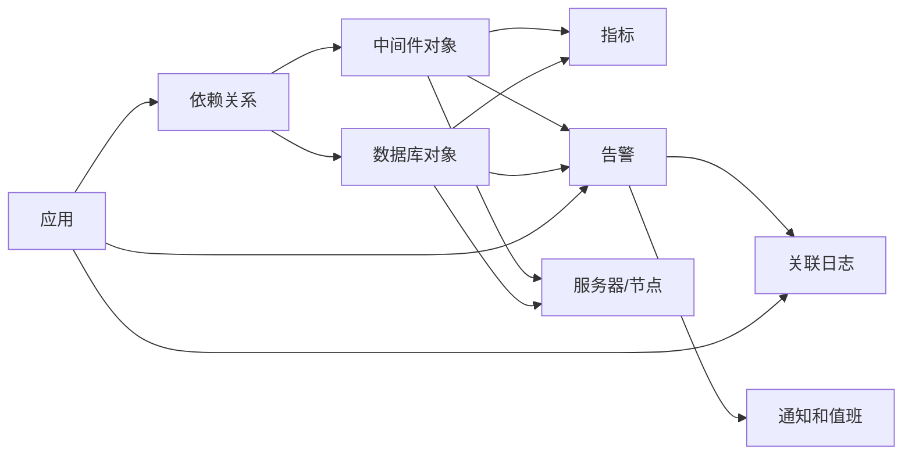
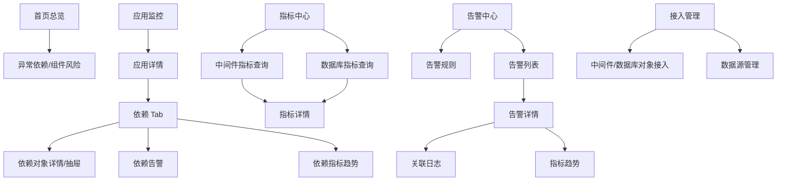

# 中间件与数据库监控需求与信息架构补充

## 1. 文档定位

本文用于补充企业级统一监控平台中“中间件与数据库监控”的一期需求口径和信息架构口径，承接以下既有约束：

- 一期优先服务应用研发负责人，其次是运维/SRE，再其次是业务负责人。
- 首页以排障视角为主，优先展示当前异常、影响对象、负责人、处理入口和关联日志/指标。
- 一期告警规则以单指标简单阈值为主，支持负责人和值班组作为通知对象。
- 一期权限模型以应用授权为核心，日志、指标、告警、关联服务器可见性从应用授权衍生。
- 一期不新增“中间件监控”“数据库监控”一级导航，先通过应用详情依赖、指标中心、告警中心和接入管理承载；二期再评估专项页面增强。

## 2. 一期纳入范围

### 2.1 对象范围

一期采用“对象类型泛化 + 主流组件模板”的方式接入，不为每一种技术栈单独设计独立产品链路。

| 类型 | 一期纳入对象 | 泛化对象口径 | 说明 |
| --- | --- | --- | --- |
| 缓存 | Redis | 中间件/缓存实例、集群、节点 | 支持单实例、主从、哨兵、Cluster 的基础健康和容量指标 |
| 消息队列 | Kafka、RabbitMQ、RocketMQ 等 MQ 可泛化 | 中间件/MQ 集群、Topic/Queue、消费组 | 一期重点看积压、消费延迟、生产/消费速率和 Broker 健康 |
| 入口代理 | Nginx、API 网关 | 中间件/网关实例、路由、上游服务 | 一期重点看请求量、错误率、延迟、5xx、上游异常 |
| 任务调度 | XXL-Job、ElasticJob、Airflow、内部调度平台等可泛化 | 中间件/任务调度平台、任务、执行器 | 一期重点看任务失败、延迟、积压、执行器存活 |
| 关系型数据库 | MySQL、PostgreSQL、Oracle | 数据库实例、集群、库、只读副本 | 一期重点看连接、QPS/TPS、慢 SQL、锁等待、容量和复制状态 |

### 2.2 一期接入深度

| 能力 | 一期口径 |
| --- | --- |
| 基础资产 | 记录对象名称、类型、环境、业务线、负责人、关联应用、部署服务器、数据源、接入状态 |
| 指标采集 | 复用 Prometheus/Grafana 或平台内置采集；展示最近采集时间、采集延迟和采集异常 |
| 指标查询 | 进入指标中心按对象类型、对象、应用、环境和时间范围查询趋势 |
| 应用依赖 | 在应用详情“依赖”Tab 展示依赖的 Redis、MQ、网关、任务调度和数据库健康状态 |
| 告警规则 | 支持为授权范围内中间件/数据库对象配置单指标阈值规则 |
| 告警事件 | 告警详情展示触发指标、影响对象、关联应用、负责人、处理记录、通知记录和指标趋势 |
| 接入管理 | 在接入管理中补充中间件/数据库对象接入状态，不要求一期独立接入向导全量覆盖 |

### 2.3 一期不纳入

- SQL 级别全量审计、SQL 回放、执行计划深度分析。
- Redis Key 级浏览、Key 内容查看、数据修改和运维操作。
- MQ 消息体查看、消息重投、消费位点手工修改。
- Nginx/API 网关配置下发、路由发布和限流策略管理。
- 任务调度的任务编排、人工补偿执行和调度配置发布。
- Oracle AWR/ASH 深度诊断、数据库自治调优。
- 自动扩容、自动故障切换、自动修复。

## 3. 核心指标

### 3.1 通用指标

所有中间件与数据库对象一期至少应统一以下字段和指标语义：

| 指标/字段 | 说明 |
| --- | --- |
| 健康状态 | 正常、预警、异常、严重、未知、未接入、采集异常 |
| 可用性 | 最近窗口内存活、探活成功率或连接成功率 |
| 请求/操作量 | QPS、TPS、请求量、命令数、生产/消费速率等 |
| 错误率 | 失败请求、异常响应、任务失败、连接失败等占比 |
| 延迟 | 平均耗时、P95、P99、最大耗时 |
| 连接数 | 当前连接、活跃连接、连接使用率、等待连接 |
| 容量 | 存储使用率、内存使用率、磁盘使用率、数据量、队列深度 |
| 数据源状态 | 指标源、日志源或采集 Agent 的状态、最近采集时间 |
| 关联应用 | 使用该对象的应用列表、依赖方向、影响范围 |

### 3.2 Redis 指标

| 指标 | 说明 | 常见级别建议 |
| --- | --- | --- |
| 实例存活 | Redis 实例或节点是否可连接 | 不可连接 P1，核心生产 P0 可配置 |
| 内存使用率 | used_memory / maxmemory | > 80% P2，> 90% P1 |
| Key 淘汰数 | evicted_keys 增长 | 持续增长 P2/P1 |
| 缓存命中率 | keyspace_hits / 总访问 | 低于业务阈值 P2 |
| 连接数 | connected_clients、blocked_clients | blocked_clients > 0 持续 P2 |
| 慢命令 | slowlog 数量或耗时 | 超阈值 P2 |
| 主从复制延迟 | replica lag | 超阈值 P1/P2 |
| Cluster 槽状态 | slot 异常、主从切换 | 异常 P1 |

### 3.3 MQ 指标

| 指标 | 说明 | 常见级别建议 |
| --- | --- | --- |
| Broker 存活 | Broker/NameServer/节点健康 | 不可用 P1，核心链路 P0 可配置 |
| 队列/Topic 积压 | 待消费消息数 | 超阈值且持续 10 分钟 P2/P1 |
| 消费延迟 | 最新消息到消费位点延迟 | 超业务阈值 P2/P1 |
| 生产速率 | 每秒写入消息数 | 异常下降或突增 P2 |
| 消费速率 | 每秒消费消息数 | 持续为 0 且有积压 P1 |
| 消费失败率 | 消费异常、重试、死信 | 超阈值 P2/P1 |
| 死信数量 | DLQ 消息数量 | 持续增长 P2 |
| Broker 磁盘/存储 | 磁盘使用率、水位 | > 85% P2，> 95% P1 |

### 3.4 Nginx/API 网关指标

| 指标 | 说明 | 常见级别建议 |
| --- | --- | --- |
| 实例存活 | Nginx/API 网关进程或探活状态 | 不可用 P1 |
| 请求量 | QPS、总请求量 | 异常突增/突降 P2 |
| 4xx/5xx 比例 | 客户端/服务端错误率 | 5xx 超阈值 P1/P2 |
| 响应延迟 | 平均、P95、P99 | P95 超阈值 P2 |
| 上游异常 | upstream timeout/reset/502/504 | 持续出现 P1/P2 |
| 活跃连接 | active/reading/writing/waiting | 超阈值 P2 |
| 路由健康 | 关键路由或上游服务健康 | 核心路由异常 P1 |
| 证书有效期 | HTTPS 证书剩余天数 | < 30 天 P3，< 7 天 P2 |

### 3.5 任务调度指标

| 指标 | 说明 | 常见级别建议 |
| --- | --- | --- |
| 调度器存活 | 调度中心或执行器健康 | 不可用 P1 |
| 任务成功率 | 成功任务 / 总任务 | 低于阈值 P2/P1 |
| 任务失败数 | 时间窗口内失败次数 | 超阈值 P2/P1 |
| 调度延迟 | 计划执行时间与实际执行时间差 | 超阈值 P2 |
| 任务积压 | 待执行、排队、重试任务数 | 持续增长 P2 |
| 执行耗时 | 平均、P95、最大耗时 | 超历史基线或阈值 P2 |
| 执行器离线 | Worker/Executor 心跳 | 离线 P1/P2 |
| 重试/补偿次数 | 重试任务数量 | 持续增长 P2 |

### 3.6 数据库指标

| 指标 | 说明 | 常见级别建议 |
| --- | --- | --- |
| 实例存活 | 数据库实例连接或探活 | 不可用 P1，核心生产 P0 可配置 |
| 连接数/使用率 | 当前连接、最大连接、活跃连接 | > 80% P2，> 90% P1 |
| QPS/TPS | 查询、事务吞吐 | 异常突增/突降 P2 |
| 慢 SQL 数量 | 时间窗口内慢查询数量 | 超阈值 P2 |
| 锁等待/死锁 | 锁等待数、死锁数、等待时长 | 持续出现 P1/P2 |
| 复制/同步延迟 | 主从、流复制、Data Guard 等延迟 | 超阈值 P1/P2 |
| 表空间/磁盘容量 | 数据文件、表空间、归档日志使用率 | > 85% P2，> 95% P1 |
| Buffer/Cache 命中率 | 缓冲命中、缓存命中 | 低于阈值 P2 |
| 会话异常 | 活跃会话、等待会话、阻塞会话 | 超阈值 P2/P1 |

## 4. 默认告警规则建议

一期规则仍遵循“单指标、比较条件、阈值、持续时间、检测周期、级别、通知对象、通知渠道”的统一模型。

| 对象 | 指标 | 默认规则建议 |
| --- | --- | --- |
| Redis | 实例存活 | 连续 3 次探活失败触发 P1 |
| Redis | 内存使用率 | 连续 5 分钟 > 90% 触发 P1，> 80% 触发 P2 |
| Redis | 主从复制延迟 | 连续 5 分钟 > 阈值触发 P1/P2 |
| MQ | 消息积压 | 超过业务阈值并持续 10 分钟触发 P2；核心链路可配置 P1 |
| MQ | 消费速率 | 有积压且消费速率连续 5 分钟为 0 触发 P1 |
| MQ | 死信数量 | 5 分钟内新增超过阈值触发 P2 |
| Nginx/API 网关 | 5xx 错误率 | 连续 5 分钟 > 阈值触发 P1/P2 |
| Nginx/API 网关 | P95 延迟 | 连续 5 分钟 > 阈值触发 P2 |
| Nginx/API 网关 | 上游 502/504 | 5 分钟内超过阈值触发 P1 |
| 任务调度 | 任务失败数 | 5 分钟内超过阈值触发 P2/P1 |
| 任务调度 | 调度延迟 | 连续 10 分钟超过阈值触发 P2 |
| 数据库 | 实例存活 | 连续 3 次连接失败触发 P1；核心生产可配置 P0 |
| 数据库 | 连接使用率 | 连续 5 分钟 > 90% 触发 P1，> 80% 触发 P2 |
| 数据库 | 慢 SQL 数量 | 5 分钟内超过阈值触发 P2 |
| 数据库 | 锁等待/死锁 | 持续锁等待或死锁超过阈值触发 P1/P2 |
| 数据库 | 复制延迟 | 连续 5 分钟超过阈值触发 P1 |
| 数据库 | 容量使用率 | > 85% 触发 P2，> 95% 触发 P1 |

告警通知对象解析优先级：

1. 对象绑定的主负责人、备份负责人。
2. 对象关联应用的应用负责人。
3. 对象所属业务线或应用组的值班组。
4. 运维/SRE 基础设施值班组。

## 5. 负责人与权限模型

### 5.1 负责人模型

中间件与数据库对象需要独立负责人，同时保留与应用负责人和值班组的关系。

| 负责人类型 | 说明 | 用途 |
| --- | --- | --- |
| 对象主负责人 | Redis/MQ/数据库/网关/调度对象的直接维护人 | 默认通知、对象信息维护、接入配置确认 |
| 对象备份负责人 | 主负责人不可达时的补充联系人 | 通知兜底、转派 |
| 关联应用负责人 | 使用该对象的应用负责人 | 判断业务影响、协同处理 |
| 业务线值班组 | 覆盖该对象或关联应用所在业务线 | 告警触达和值班处理 |
| 运维/SRE 值班组 | 跨应用基础设施或共享组件兜底 | 共享对象、平台级对象和无人认领对象处理 |

共享对象需要明确“主维护团队 + 影响应用列表”。告警详情中负责人显示顺序建议为：当前处理人、对象负责人、关联应用负责人、值班组。

### 5.2 权限模型

一期仍以应用授权为主，但中间件和数据库存在共享对象，需要补充对象归属与衍生可见规则。

| 场景 | 可见规则 |
| --- | --- |
| 应用专属对象 | 用户拥有该应用权限时，可见该对象摘要、指标、告警和接入状态 |
| 多应用共享对象 | 用户仅可见与其授权应用相关的影响信息；对象全局指标由运维/SRE、对象负责人或管理员可见 |
| 平台级共享对象 | 默认仅运维/SRE、平台管理员、对象负责人可见；应用负责人只通过告警影响范围看到必要摘要 |
| 数据库对象 | 普通应用负责人可见健康、连接、慢 SQL 数量、锁等待等摘要；SQL 文本、库表名、会话明细按敏感权限控制 |
| MQ 对象 | 应用负责人可见授权应用相关 Topic/Queue/消费组；其他消费组名称和积压不泄露 |
| 网关对象 | 应用负责人可见授权应用相关路由、上游和错误率；全局路由配置仅运维/SRE 可见 |
| 任务调度对象 | 应用负责人可见授权应用或业务线任务；跨业务任务仅展示授权范围内数据 |

操作权限建议：

| 操作 | 平台管理员 | 运维/SRE | 对象负责人 | 应用负责人 | 值班人员 | 只读用户 |
| --- | --- | --- | --- | --- | --- | --- |
| 查看对象列表/详情 | 全部 | 授权/基础设施范围 | 负责对象 | 关联授权应用范围 | 值班触发窗口 | 授权范围 |
| 查询指标 | 全部 | 授权范围 | 负责对象 | 关联授权应用范围 | 告警窗口 | 授权范围只读 |
| 新建/编辑规则 | 全部 | 授权范围 | 负责对象 | 关联应用且有规则权限 | 不可 | 不可 |
| 处理告警 | 全部 | 授权范围 | 负责对象 | 关联应用告警 | 值班范围 | 不可 |
| 修改接入配置 | 全部 | 授权范围 | 负责对象可申请/维护 | 默认不可 | 不可 | 不可 |
| 查看敏感明细 | 敏感权限 | 敏感权限 | 敏感权限 | 默认不可 | 默认不可 | 不可 |

所有规则修改、接入变更、敏感字段查看、导出和越权访问必须写入审计。

## 6. 与应用、服务器、日志、指标、告警的关系

### 6.1 对象关系

### 6.2 与应用监控的关系

- 应用详情增加或强化“依赖”Tab，展示数据库、Redis、MQ、网关、任务调度等依赖的健康状态。
- 应用详情概览可展示“异常依赖数”和“依赖告警数”，点击进入依赖列表或告警列表。
- 依赖异常时，应支持从应用详情跳转到指标趋势、告警详情和日志查询。
- 关联应用是权限过滤、负责人解析和影响范围展示的主线。

### 6.3 与服务器监控的关系

- 中间件/数据库实例需要关联部署服务器或节点。
- 对象详情或指标中心可展示节点 CPU、内存、磁盘、网络摘要，但不替代服务器详情。
- 从数据库容量、MQ 磁盘水位、Redis 内存异常可跳转服务器详情查看资源瓶颈。
- 无服务器权限的应用负责人只看与对象相关的服务器摘要，不展示进程、端口和敏感配置。

### 6.4 与日志中心的关系

- 一期不要求所有中间件/数据库日志进入统一检索，但告警详情应能跳转关联应用日志。
- 若对象日志已接入，可在日志中心按对象类型、对象、环境、实例、时间范围检索。
- 从数据库或中间件告警跳日志时，默认带入关联应用、环境、触发时间前 10 分钟至后 20 分钟、错误级别或关键词。
- 数据库 SQL 文本、MQ 消息内容、网关请求头等敏感内容默认脱敏，并受敏感权限和审计约束。

### 6.5 与指标中心的关系

- 中间件和数据库指标统一进入指标中心，作为“指标类型 = 中间件/数据库”的过滤项。
- 指标详情需要展示对象类型、对象名称、环境、关联应用、数据源、最近采集时间、单位、标签。
- 指标趋势支持从告警触发点、应用依赖、对象列表进入，并保留时间窗口和环境。
- 指标可作为告警规则数据来源；无指标数据或采集异常时不可保存并启用规则。

### 6.6 与告警中心的关系

- 告警规则对象类型补充或明确支持：中间件、数据库。
- 告警列表支持按对象类型、对象、关联应用、负责人、环境、级别、状态筛选。
- 告警详情“影响对象”需要展示对象本身、关联应用、部署节点和可能受影响接口/任务/消费组。
- 告警处理仍使用既有状态机：已触发、已通知、已确认、处理中、已恢复、已关闭、已升级、已静默。

## 7. 信息架构与页面层级建议

### 7.1 导航策略

一期不新增一级导航，避免平台按技术组件碎片化。建议在既有导航中补充以下页面能力：

| 一级导航 | 一期补充页面/区块 | 定位 |
| --- | --- | --- |
| 首页总览 | 异常依赖、共享组件风险、数据库/MQ 高风险告警 | 作为排障入口，展示影响应用和负责人 |
| 应用监控 | 应用详情/依赖 Tab、依赖告警、依赖指标入口 | 从应用视角定位依赖问题 |
| 指标中心 | 中间件指标查询、数据库指标查询、对象指标详情 | 查询趋势、对比和创建规则 |
| 告警中心 | 中间件/数据库规则与告警筛选、告警详情影响对象 | 完成触发、通知和基础处理闭环 |
| 接入管理 | 中间件/数据库对象接入、数据源状态、采集模板 | 管理对象、数据源和接入状态 |
| 系统管理 | 对象负责人、对象权限补充、审计 | 支撑共享对象权限和责任边界 |

二期可评估新增“基础组件监控”一级导航或在“应用监控”下增加“依赖监控”二级页面，但一期先隐藏或预留入口。

### 7.2 页面层级

### 7.3 关键页面字段

#### 应用详情/依赖 Tab

| 字段 | 说明 |
| --- | --- |
| 依赖名称 | Redis 集群、MQ Topic/Queue、数据库实例、网关路由、调度任务 |
| 对象类型 | Redis、MQ、Nginx/API 网关、任务调度、MySQL/PostgreSQL/Oracle |
| 环境 | 生产、预发、测试、开发 |
| 健康状态 | 正常、预警、异常、严重、未知、未接入、采集异常 |
| 核心指标 | 按对象类型展示 3-5 个最高价值指标 |
| 未恢复告警 | 当前对象关联告警数量和最高级别 |
| 负责人 | 对象负责人、关联应用负责人、值班组 |
| 操作 | 查看指标、查看告警、查日志、查看接入状态 |

#### 指标中心/中间件与数据库查询

| 字段 | 说明 |
| --- | --- |
| 筛选 | 环境、对象类型、对象、关联应用、业务线、负责人、状态、数据源、时间范围 |
| 列表 | 对象名称、类型、环境、健康状态、关键指标、关联应用数、负责人、最近采集 |
| 趋势 | 指标曲线、阈值线、告警触发点、采集延迟、缺失点 |
| 操作 | 创建告警规则、导出指标、收藏、查看接入状态 |

#### 接入管理/对象接入

| 字段 | 说明 |
| --- | --- |
| 基本信息 | 对象名称、编码、类型、环境、业务线、维护团队、负责人 |
| 关联关系 | 关联应用、部署服务器、集群节点、数据源 |
| 接入状态 | 指标接入、日志接入、Agent 心跳、最近验证、采集异常 |
| 采集模板 | Redis、MQ、网关、任务调度、MySQL、PostgreSQL、Oracle 模板 |
| 默认规则 | 可勾选容量、存活、延迟、积压、慢 SQL 等默认规则 |

## 8. 一期/二期边界

| 能力 | 一期 | 二期 |
| --- | --- | --- |
| 导航 | 不新增一级导航，通过应用依赖、指标中心、告警中心、接入管理承载 | 评估基础组件监控/依赖监控专项入口 |
| 对象范围 | Redis、MQ、Nginx/API 网关、任务调度、MySQL/PostgreSQL/Oracle 泛化接入 | 扩展 Elasticsearch、MongoDB、ClickHouse、对象存储、注册中心等 |
| 指标 | 核心健康、容量、吞吐、延迟、错误、连接、复制/积压指标 | 组件深度诊断、拓扑、基线、容量预测 |
| 告警 | 单指标简单阈值、负责人和值班组通知、重复通知间隔 | 组合条件、动态阈值、告警合并、完整静默和升级 |
| 权限 | 应用授权衍生 + 对象负责人/运维补充权限 | 独立对象权限、审批流、多租户、环境精细化 |
| 日志 | 关联应用日志跳转；对象日志可选接入 | 中间件/数据库日志专项检索与诊断 |
| 数据库能力 | 慢 SQL 数量、连接、锁等待、容量、复制延迟 | SQL 文本治理、执行计划、AWR/ASH、索引建议 |
| MQ 能力 | 积压、延迟、消费失败、死信、Broker 健康 | 消息轨迹、重投、消费位点治理 |
| Redis 能力 | 内存、命中率、连接、慢命令、复制/Cluster 状态 | Key 分析、热 Key、大 Key、容量优化建议 |
| 网关能力 | QPS、5xx、延迟、上游异常、证书有效期 | 路由拓扑、限流熔断策略、配置变更关联 |
| 任务调度 | 失败、延迟、积压、执行器状态 | 任务补偿、依赖编排、调度链路分析 |

## 9. 验收点

### 9.1 范围与接入

| 编号 | 验收点 |
| --- | --- |
| MDB-AC-01 | 接入管理可登记 Redis、MQ、Nginx/API 网关、任务调度、MySQL/PostgreSQL/Oracle 等对象，并标记环境、负责人、关联应用和数据源 |
| MDB-AC-02 | 对象接入状态可区分指标已接入、仅日志、未接入、采集异常、验证中 |
| MDB-AC-03 | 数据源异常时，对象列表、应用依赖、指标查询和告警规则均展示采集异常或无指标数据 |

### 9.2 指标与页面

| 编号 | 验收点 |
| --- | --- |
| MDB-MET-01 | 指标中心可按对象类型、对象、关联应用、环境和时间范围查询中间件/数据库指标 |
| MDB-MET-02 | Redis、MQ、网关、任务调度和数据库至少各有一组核心指标可展示趋势 |
| MDB-MET-03 | 应用详情“依赖”视图能展示关联中间件/数据库的健康状态、核心指标、负责人和未恢复告警 |
| MDB-MET-04 | 从应用依赖、告警详情、指标列表进入指标趋势时，环境、对象、时间窗口和来源上下文完整保留 |

### 9.3 告警

| 编号 | 验收点 |
| --- | --- |
| MDB-AL-01 | 告警规则对象类型支持中间件和数据库，并可选择授权范围内对象和指标 |
| MDB-AL-02 | 可为 Redis 内存、MQ 积压、网关 5xx、任务失败、数据库连接/慢 SQL/容量等指标创建简单阈值规则 |
| MDB-AL-03 | 未接入指标或采集异常对象不可保存并启用依赖指标的告警规则 |
| MDB-AL-04 | 告警详情展示触发指标、阈值、影响对象、关联应用、负责人、通知记录、处理记录和指标趋势 |
| MDB-AL-05 | 告警通知可解析对象负责人、关联应用负责人和值班组，通知失败有记录 |

### 9.4 权限与安全

| 编号 | 验收点 |
| --- | --- |
| MDB-PERM-01 | 应用负责人只能看到授权应用相关的中间件/数据库对象摘要、指标和告警 |
| MDB-PERM-02 | 共享对象不会向未授权用户泄露其他应用、消费组、路由、库表或敏感 SQL 信息 |
| MDB-PERM-03 | 运维/SRE、对象负责人、平台管理员可按权限查看对象全局状态和配置接入 |
| MDB-PERM-04 | 敏感明细查看、导出、规则修改、接入配置变更和越权访问均写入审计 |

### 9.5 排障链路

| 编号 | 验收点 |
| --- | --- |
| MDB-FLOW-01 | 首页出现中间件/数据库相关 P0/P1/P2 告警时，可进入告警详情并看到影响应用和负责人 |
| MDB-FLOW-02 | 应用依赖异常时，3 次点击内可到达告警详情、指标趋势或关联日志 |
| MDB-FLOW-03 | 数据库、MQ、Redis、网关或任务调度异常能在应用详情中体现为依赖风险，不误判应用完全正常 |
| MDB-FLOW-04 | 未接入和采集异常与业务异常分开展示，未接入不计入业务异常统计，采集异常计入接入风险 |

## 10. 后续待确认

| 问题 | 影响范围 |
| --- | --- |
| 一期优先接入的 Redis、MQ、数据库、网关、任务调度对象清单 | 接入计划、默认规则、演示数据 |
| 共享数据库和共享 MQ 的应用依赖关系是否已有 CMDB 或配置来源 | 权限过滤、影响范围、负责人解析 |
| 数据库 SQL 文本、库表名、会话信息的敏感级别和脱敏规则 | 日志、指标标签、告警详情、导出 |
| MQ Topic/消费组、网关路由、任务名称是否存在跨业务线保密要求 | 列表字段、权限、导出 |
| Prometheus Exporter、数据库采集账号、网关日志源是否已具备生产接入条件 | 数据源接入、采集异常、验收环境 |
| 中间件/数据库对象负责人以 CMDB、应用资产库还是平台手工维护为准 | 负责人模型、通知和值班 |
